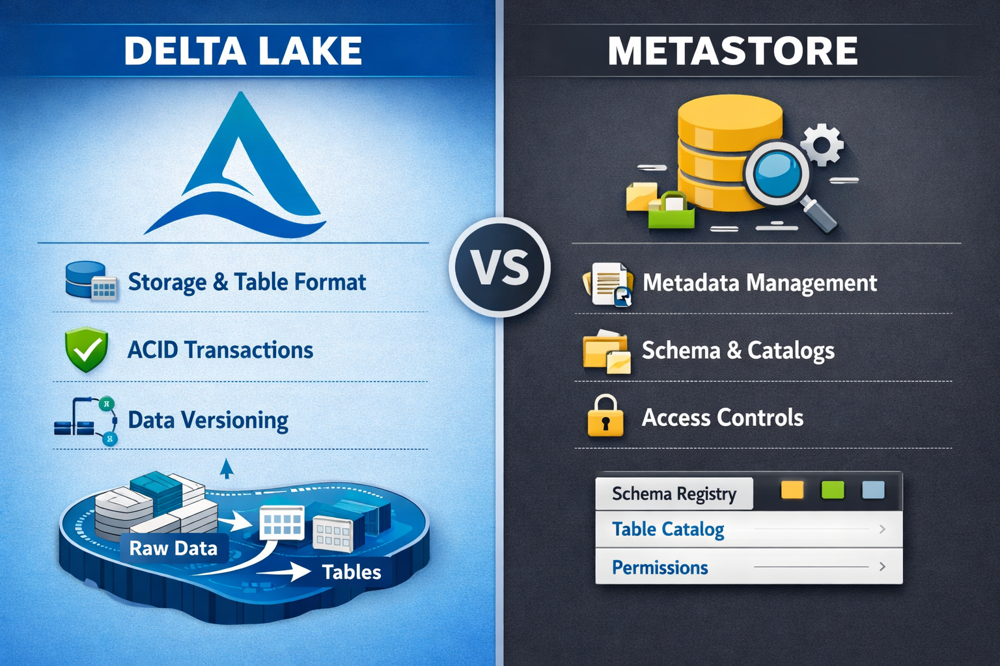
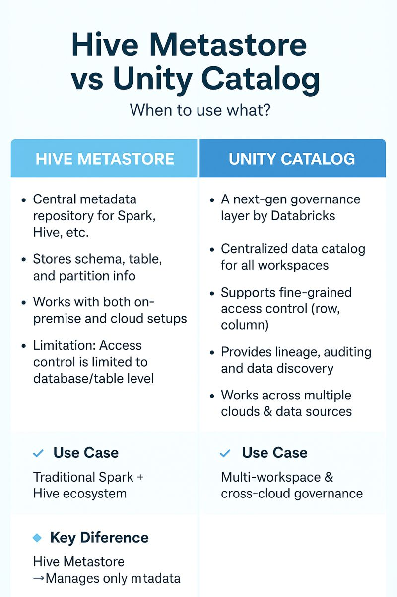

# Metastore - Hive VS Unity Catalog - DBFS vs Cloud Storage

## Metastore
Metadata Repository
> Does not store data. Stores information **about** the data.

- ✅ Stores metadata
  - Table name
  - Columns and data types
  - Physical location in storage
  - Format (Delta, Parquet)
  - Partitions and properties
  - Associated permissions

- ✖️ DOES NOT store data
  - Parquet/Delta files come in S3, ADLS, or GSC

---

## Example: Create a table

```SQL
CREATE TABLE sales.transactions (
    id INT,
    amount DECIMAL(10,2),
    date DATE
) USING DELTA;
```

The metastore stores...
- Table name
- Columns and data types
- Physical storage locations
- Format: Delta, Parquet...
- Partitions
- Associated permissions

---



---

## Hive Architecture

```
Workspace A
└── Hive Metastore A
    └── databases
        └── tables → S3 / DBFS
```
> Workspace B would have its own independent Hive Metastore B

### Features
- One metastore per workspace
- Stores: Databases, Tables, Views, Partitions
- No centralized governance
- Workspaces completely isolated from each other

---

## Unity Catalog Architecture

```
└── Account Level
    └── Unity Catalog Metastore (by region)
        └── Catalog
            └── Schema
                └── Table
```

> Multiple workspaces share the same central metastore

### What Unity Catalog Manages
- Catalogs
- Schemas and Tables
- Volumes and External Locations
- Permissions and Credentials
- Data Lineage
- Shared across multiple workspaces

---

## Hive Structure

```
.
└── Workspace
    └── Metastore (implicit)
        └── Database = Schema
            └── Table
```

- Database and Schema were equivalent
- No visible catalog concept
- Only 2 visible logical levels
> `CREATE DATABASE` creates a folder in dbfs:/user/hive/warehouse/

> ## Namespace before:
``` SQL
SELECT *
FROM sales.transactions;
```

> ### Namespace: database.table
```SQL
sales.transactions
```
> - sales `databases`
> - transactions `table`
> 
> There is nothing above database

---

## New Structure

```
└── Account Level
    └── Metastore (One per region)
        └── Catalog ← New!
            └── Schema
                └── Table
```

- New level: Catalog required (*)
- Schema still exists
- 3 visible levels

### `Namespace now`
``` SQL
SELECT *
FROM company_analytics.sales.transactions;
```

### Namespace: `catalog.schema.table`
```SQL
company_analytics.sales.transactions
```
> - company_analytics `catalog`
> - sales `schema`
> - transactions `table`

### Create Structure

```SQL
CREATE CATALOG company_analytics;

CREATE SCHEMA company_analytics.sales;

CREATE TABLE company_analytics.sales.transactions (...);
```

---




---

## Before vs Now Summary

| **Aspect**              | **Before (Hive)**        | **Now (Unity Catalog)**            |
|---------------------|----------------------|--------------------------------|
| Metastore           | Per workspace        | Account level                  |
| Visible Catalog     | Did not exist        | Required                       |
| Database / Schema   | Equivalent           | Schema still exists            |
| Namespace           | database.table       | catalog.schema.table           |
| Logical Levels      | 2 levels             | 3 levels                       |
| Governance          | No centralized governance | Centralized and shared   |
| Workspace           | Isolated metastores  | Share a metastore              |

---

## What is DBFS?
An abstraction layer over cloud storage

`dbfs:/user/hive/warehouse/` → Actually, it's → `s3://databricks-workspace-bucket/...`

### Physical Storage
- Amazon S3
- Azure ADSL
- Google GCS
> DBFS provides user-friendly paths, but the data always ends up in the cloud.

---

