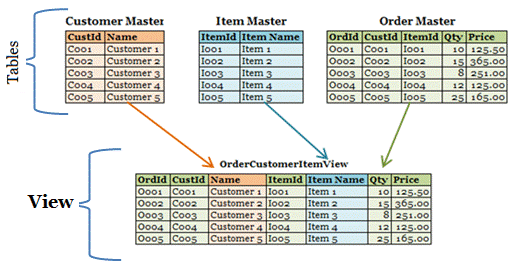

# Cloning tables in Delta Lake, Time Travel, Temporary and Global Views

## Cloning in Delta Lake Tables?

### What is Cloning?

- Creates fast copies of Delta tables
- Without physically copying data (shallow cloning)
- Works with terabytes in seconds
- Ideal for testing, backups, and dataset replication

### Two Types of Cloning
- **Shallow Cloning:** Copies only the metadata, pointing to the original files
- **Deep Cloning:** Copies both metadata and data physically, creating separate tables

---

## Shallow Clone

**Creates a new table that points to the same source data files**

- Only copies the metadata
- Extremely fast, almost zero additional storage
- Depends on the original files

```SQL
CREATE TABLE sales_clone
SHALLOW CLONE sales;

-- With specific location
CREATE TABLE dev.sales_clone
SHALLOW CLONE prod.sales;
LOCATION "/mnt/dev/sales_clone";
```


---

## Deep Clone

**Physically copies data and metadata, creates a completely independent table**

- Copies metadata and data files
- Table independent of the source
- Slower, uses additional storage

```SQL
CREATE TABLE sales_backup
DEEP CLONE sales;

-- With specific location
CREATE TABLE sales_backup
DEEP CLONE sales
LOCATION "/mnt/dev/sales";
```


---

| Feature                         | Shallow Clone                                      | Deep Clone                                              |
|---------------------------------|----------------------------------------------------|----------------------------------------------------------|
| Copies physical data            | ❌ No (reuses source files)                        | ✅ Yes (creates new copies of data files)                |
| Copies metadata                 | ✅ Yes                                             | ✅ Yes                                                   |
| Speed                           | ⚡ Very fast (almost instant)                      | 🐢 Slower (depends on data size)                         |
| Storage usage                   | 💾 Minimal (no extra data storage)                 | 💾 High (duplicates all data)                            |
| Independence                    | ❌ Depends on source table                         | ✅ Fully independent                                     |
| Use case                        | Quick testing, dev environments, experimentation   | Backups, migrations, long-term isolation                 |
| Risk if source is deleted       | ⚠️ High (clone breaks if data files are removed)   | ✅ None (data is stored independently)                    |


---

## Time Travel: Cloning Specific Versions

> Delta Lake maintains a version history for each table. You can clone any previous version.

### By Version Number
```SQL
CREATE TABLE sales_v10
DEEP CLONE sales
VERSION AS OF 10;
```

### By Timestamp
```SQL
CREATE TABLE sales_feb
DEEP CLONE sales
TIMESTAMP AS OF '2026-02-01';
```

- **Replay Old Datasets:** Reverts to any previous state of the data.

- **Pipeline Debugging:** Analyzes data exactly at the time of the error.

- **Data Auditing:** Regulatory compliance and traceability

---

## Real-World Uses in Data Engineering

### Pipeline Testing
Clone production to development without affecting production data.
```SQL
CREATE TABLE dev.sales_test
SHALLOW CLONE prod.sales;
```

### Rapid Backup
Complete and independent snapshot before critical transformations.
```SQL
CREATE TABLE
sales_backup_20260401
DEEP CLONE sales;
```

### Error Reproduction
Restore the data to the exact state at the time the error occurred.
```SQL
CREATE TABLE sales_debug
DEEP CLONE sales
VERSION AS OF 42;
```

---

| Aspect            | CTAS (CREATE TABLE AS SELECT)                      | CLONE (Shallow / Deep)                                      |
|-------------------|---------------------------------------------------|-------------------------------------------------------------|
| Mechanism         | Creates a new table from a query result           | Copies an existing table (metadata + optionally data)       |
| Transformation    | ✅ Yes (you can filter, join, transform data)     | ❌ No (exact copy, no changes allowed)                      |
| Structure         | Can be modified (new schema based on query)       | Same as source table (schema is preserved)                  |
| Delta History     | ❌ Not preserved (new table starts fresh)         | ✅ Preserved (inherits source table history)                |
| Speed             | 🐢 Slower (depends on query + data processing)    | ⚡ Faster (especially shallow clone)                         |
| Use case          | Data transformation, aggregations, new datasets   | Backups, testing, environment replication                   |

---

## What is a View?

**A saved SQL query that behaves like a table**

- It doesn't physically store data.
- It only stores the logic of the `SELECT` statement.
- It is executed at the time of the query.
- It allows for data abstraction and security.

### Example: Creating a View

```SQL
CREATE VIEW active_users AS
SELECT *
FROM users
WHERE active = true;

-- View the created view
SELECT * 
FROM active_users;
```



---

## What are Views used for?

### 1. Simplifying Queries
> Encapsulates complex logic in a reusable view
```SQL
CREATE VIEW sales_summary AS
SELECT region, SUM(amount) AS TOTAL
FROM sales
GROUP BY region;
```

### 2. Data Abstraction
> Combines multiple tables into a single view
```SQL
CREATE VIEW customer_orders AS
SELECT c.name, o.order_id, o.amount
FROM customers c
JOIN orders o
ON c.id = o.customer_id;
```

### 3. Security with Unity Catalog
> Hides PII columns, exposing only permitted data
```SQL
CREATE VIEW safe_users AS
SELECT user_id, name
FROM users;
-- Hide email & phone
```

---

## Create and Replace a View

### Create View
Basic syntax for creating a view in a specific schema
```SQL
CREATE VIEW analytics.high_value_orders AS
SELECT order_id, customer_id, amount
FROM orders
WHERE amount > 1000;
```


### Create or Replace View
Updates the logic of an existing view without manually recreating it
```SQL
CREATE OR REPLACE VIEW analytics.high_value_orders AS
SELECT order_id, customer_id, amount, status
FROM orders
WHERE amount > 500;
```

> Common in data pipelines to update logic without deleting the view

---

## Temporary Views

- **Duration:** Current session only
- **Visibility:** Not shown in the catalog
- **Scope:** Current user/session
- **Ideal Use:** Intermediate transformations

```SQL
-- Create a Temporary View
CREATE TEMP VIEW temp_high_sales AS
SELECT *
FROM sales
WHERE amount > 5000;

-- Use in the same session
SELECT region, COUNT(*)
FROM temp_high_sales
GROUP BY region;
```

> ⚠️ When you close the session or notebook, the Temporary View disappears automatically

---

## Global Temporary Views

- **Scope:** All cluster sessions
- **Duration:** Until the cluster stops
- **Special Schema:** `global_temp`

Always access with the prefix:
`global_temp.view_name`

### Create Global Temporary View
```SQL
CREATE GLOBAL TEMP VIEW global_sales AS
SELECT *
FROM sales
WHERE year = 2026;
```

### Query from any session
```SQL
SELECT *
FROM global_temp.global_sales
WHERE region = "LATAM"
```

---

## Temporary vs Global Temporary View

| Characteristics        | Temporary View                                      | Global Temporary View                                      |
|-----------------------|-----------------------------------------------------|-------------------------------------------------------------|
| Syntax                | CREATE OR REPLACE TEMP VIEW view_name AS SELECT...  | CREATE OR REPLACE GLOBAL TEMP VIEW view_name AS SELECT...  |
| Scope                 | Session-scoped                                      | Application-scoped (shared across sessions)                |
| Duration              | Exists only during the current session              | Exists until the Spark application ends                    |
| Schema                | Not tied to any database/schema                     | Stored in a system database (global_temp)                  |
| Access                | Accessible only within the same session             | Accessible from any session using global_temp.view_name    |
| Catalog Visibility    | Not visible in catalog listings                     | Visible under the global_temp database                     |
| Common Use            | Intermediate transformations within a session       | Sharing temporary data between different notebooks/sessions|