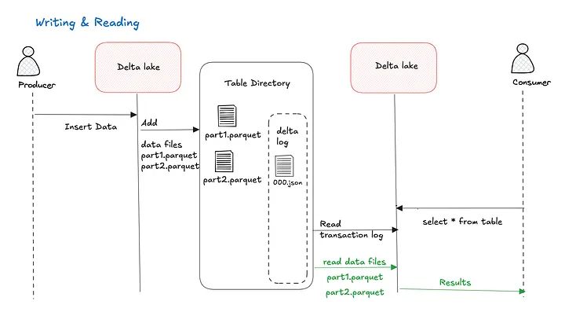
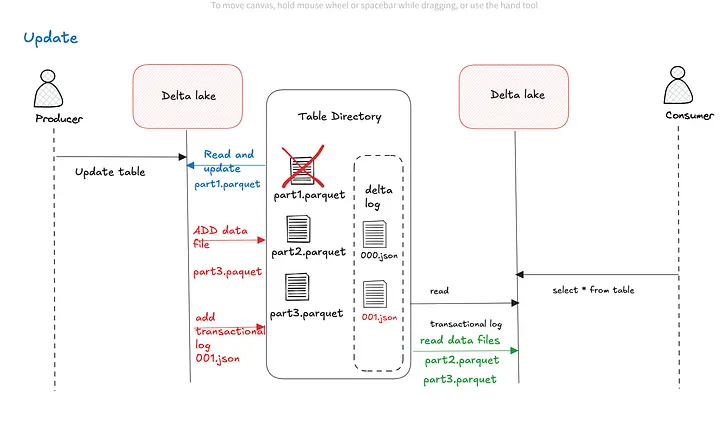
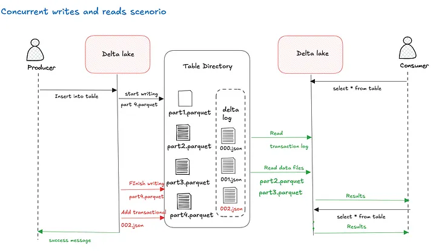
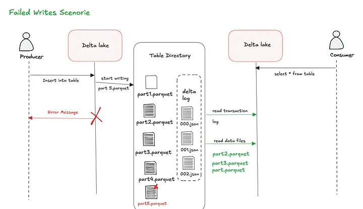

## Git Folders in Databricks

### What are Git Folders?
Workspace folders directly connected to a Git repository. Code is versioned and synchronized with Git.

- Natural evolution of Databricks Repos
- More seamless integration into the workspace
- They behave like any other folder
- They improve the team development experience

**Main advantages:**

- Integrated version control
- Facilitates collaborative work
- Compatible with CI/CD workflows
- Without changing how Git works

---

## Git Basics

### Repository
The container for your project; everything lives there: notebooks, scripts, configurations, and the change history.

**How ​​does it work in Databricks?**
- You clone the repository into a Git Folder.
- Everything you modify belongs to that repository.
- Each change can be versioned.
- Complete history of the project's evolution.

_Example: A repository contains all your notebooks for a Machine Learning project._

### Branch

**An independent line of work**. It allows you to experiment without affecting the stable code.

**How does it work in Databricks?**

- Main branch: main or master (stable code)
- Development branches: for features or experiments
- Changing branches changes the project version
- You can have multiple active branches.

_Example: Branch 'feature/new-model' to develop without breaking main_

## Git Essentials

### Commit
Creates a snapshot of your changes at a specific point in time.

**In Databricks:**
- You edit notebooks or files and commit to save the history.

- Allows you to revert to a previous version if something goes wrong.
_git commit -m 'Updated prediction model'_
> Local Snapshot

### Push
Sends your commits to the remote repository (e.g., GitHub) to share your work.

**In Databricks:**
- Sends changes from your Git folder to the remote repository, making them visible.

- Integrates with CI/CD pipelines for automation.

_⚠ Caution! Always 'pull' before 'push'._
> Share Changes

### Pull
Brings changes from the remote repository to your workspace to keep you up to date.

**In Databricks:**
- Updates your workspace with team changes.

- Reduces conflicts by integrating collaborative work. 💡
Frequent pulls to avoid major conflicts
> Update Local

## Code Integration

### Merge
The process of combining changes from one branch to another, e.g., merging a feature into the main branch.

- Combines the histories of different branches.
- Executed using the Git platform.
- Reflects the post-merge state.
- May require conflict resolution.

**feature/new-model = main**

### Pull Request (PR): A request to integrate changes. It's a space for review, discussion, and validation.

**Critical in Databricks:**
- Code review before production.
- Error detection and validation.
- Verification of team standards.
- Technical discussion about changes.

**Typical PR Flow:**
1. Develop in a feature branch.
2. Create a PR to the main branch.
3. The team reviews and comments on the code.
4. Make adjustments based on feedback.
5. Approve and merge.

**A PR is a quality process, not just a merge**_

---
## GitHub and Databricks configuration
- Link your GitHub account through the website.
- Create a repository or clone your GitHub repository within Databricks:
1. In your project folder, select "Git Folder"
2. Copy the Git URL
3. Click "Create Git folder".

--- 

## Delta Lake: Databricks' Reliability Layer

### What is Delta Lake?

A file-based storage layer (S3, ADLS, GCS) that adds reliability and data control.

**Turns a 'raw' data lake into a reliable one**

✖️ Without Delta Lake
- Corrupted or inconsistent data
- Concurrent read failures
- No change history

✅With Delta Lake
- ACID transactional tables
- Consistent reads every time
- Time travel and auditing (past time)

**Key Features**
- ACID transactions
- Transaction log
- Time travel
- Scalability

## Reliability in Delta Lake: ACID Transactions

**Delta Lake allows multiple processes to work on the same data simultaneously without risk of corruption.**
_(With 'pure' Parquet, it's very easy to corrupt the data.)_

✖️ Without Delta Lake (Parquet)
**One job writes while another reads:**
- Incomplete data reading
- Unexpected failures in read jobs
- Incorrect results without warning

✅ With Delta Lake
**Control layer over Parquet:**
- On top: A transaction log (Delta Log)
- Result: Data consistency and versioning
- It behaves like a real database

## ACID Transactions: The Reliability Guarantee

- A: **Atomization**, the operation either completes or doesn't occur.

- C: **Consistency**, the data always remains in a valid state.

- I: **Isolation**, reads don't see incomplete writes.
- D: **Durability**, a persistent change isn't lost.

**You can read data with the assurance that it's correct, even if someone is writing at the same time.**

### An example: Banking Software

In a banking system, when I make a transfer, the money should be deducted from my account and credited to the recipient's account as a single transaction.

If any of the steps fail during the process, the entire transaction is canceled, and the money remains in its original state; that is, the transfer is either completed or not completed at all.

---

## Transaction Log: The central mechanism of Delta Lake

**Detailed and organized record of every operation on a Delta table**

_The log is the single source of truth._

**Physical Location**
Folder: _delta_log/
- Ordered JSON files (000.json), (001.json)
- Each JSON file is a commit and a new version of the table

### How does it work?

1. An operation modifies data
2. New Parquet files are written
3. A JSON file is added to the log pointing to the new files
4. The engine queries the log to determine which files to read.

>🌟Key benefits: ACID transactions, time travel, and complete auditing

**⚠️The log is append-only: IT IS NEVER OVERWRITTEN, ONLY NEW VERSIONS ARE ADDED**

## Scenario 1: Writing & Reading

## Scenario 2: Updating

## Scenario 3: Concurrent Writes & Reads

## Scenario 4: Failed Writes
