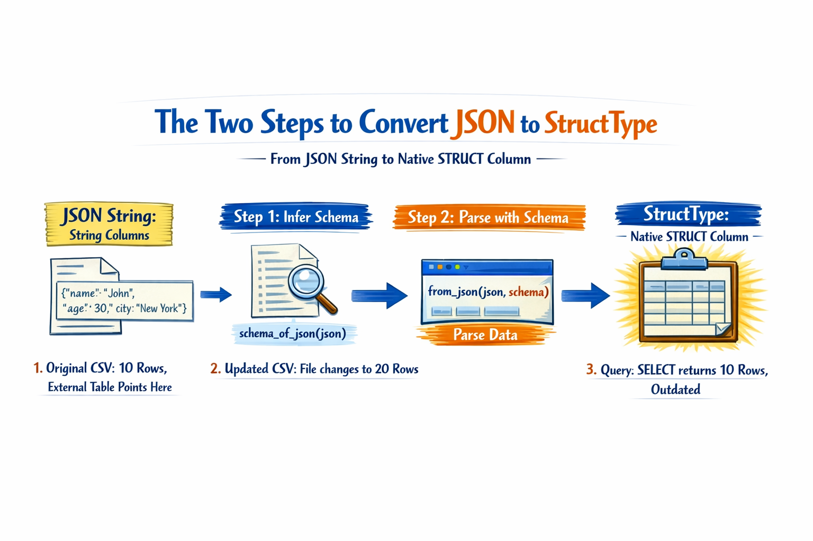
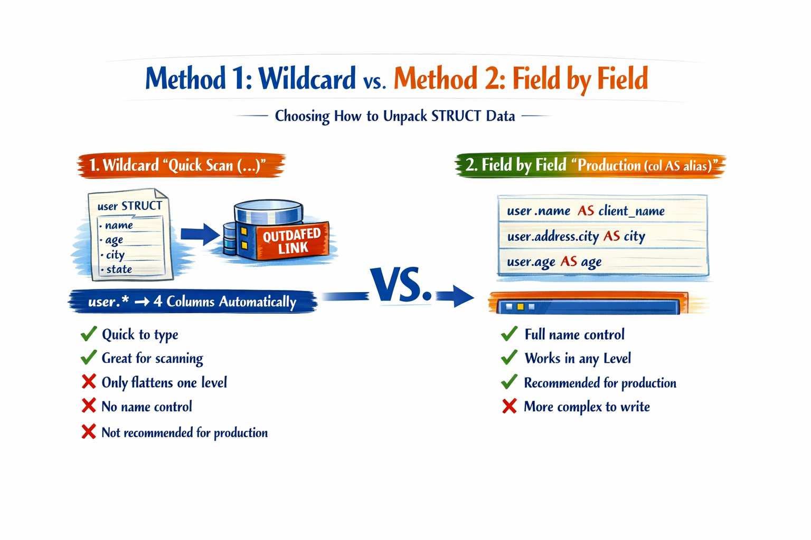

# Parsing nested data, Conversion to StructType, Flattening structures

## What is Plain JSON?

All fields at the same level
- No hierarchy or internal objects
- Each field has a single value
- Easy to read and process directly

> Simple structure, Spark reads it natively

### Plain JSON (Real Example)
```JSON
{
    "id": 1,
    "name": "Caleb",
    "city": "Medellin",
    "age": 27
}
```

- Key in quotes
- Text value in quotes
- Number without quotes
- {} Separate the object

> All values ​​are single, string or number, without nesting

---

## What is Nested JSON?

Fields with structures inside
- Nested objects: fields with subfields
- Arrays []: Lists of values ​​or objects
- Can have multiple levels of depth

> Real complexity, requires special tools

### Nested JSON (Real Example)
```JSON
{
    "id": 1,
    "name": "Caleb",
    "address": { // ← nested object
        "city": "Medellin",
        "country": "Colombia"
    },
    "purchases": [ // ← arrays of objects
        {"product": "laptop", "price": 800},
        {"product": "mouse", "price": 20}
    ]
}
```

---

## Spark reads nested JSON as plain text

### Input JSON file
```JSON
{
    "first_name": "Bart",
    "last_name": "Simpson",
    "gender": "Male",
    "address": {
        "street":"742 Evergreen Terrace",
        "city": "Springfield",
        "Country": "United States"
    }
}
```
> Complex structure with nested fields

Spark Ingests → Interprets as... ⚠️

### Resulting DataFrame (data_user `STRING`)
```JSON
"{
    \"first_name\":\"Bart\",\"address\":{\"street\":\"742...
}"
```
> ✖️ All JSON is treated as plain text; it cannot be navigated directly.

---

## Colon Syntax for Extracting Fields

### The `:` Operator Navigates JSON as Text
1. STRING Column: The column contains the complete JSON as text
2. First Level: column: field → extracts field from the root object
3. Nested: column: field: subfield → chaining
> Ideal for quickly extracting 1 or 2 fields

### How to Navigate with `:`
user_data = STRING column
- `:` → "name" → "John Wick" (1 level)

Chaining → 2 levels (nested)
- `:` → "location" `:` → "city" → Madrid

---

## The Golden Rule: Colon vs. Period

### `JSON STRING`
**Colon:** The column contains JSON as text. Spark must parse the text each time.

- ✅ Fast for 1-2 fields
- ✅ No prior conversion required
- ✖️ Slower (parsing on each row)
- ✖️ No Catalyst optimization

## VS

### `Native STRUCT`
**Period:** The column is a STRUCT. Spark accesses the binary structure directly.
- ✅ Faster (direct access)
- ✅ Catalyst optimization enabled
- ✅ Works with `WHERE`, `GROUP BY`, etc.

> Use `:` for JSON STRING, use `.` for native STRUCT.
> Convert to STRUCT whenever you use the field more than once.

---

## `StruckType`: Spark's native representation

### `STRUCT`: user
```JSON
id      "LongType"
name    "StringType"
address "StructType"
    - city "StringType"
    - country "StringType"
purchases "ArrayType"
```
> Typed structure recognized by Spark

### Why is it better than STRING?

- **Binary and native:** Spark understands it directly, without parsing text in each operation.
- **Catalyst optimizes it**: The Spark engine can read only the necessary fields (column pruning).
- **Type-safe**: Each field has a defined type. Fewer errors in production.
- **Direct access with a dot (`.`)**: No additional functions to navigate the structure.

---

## The Two Steps to Convert JSON to StructType



### Step 1: `schema_of_json`
Parses a sample of the JSON and automatically generates the schema (data types for each field)
- Input: A sample JSON string
- Output: A schema with detected types
> You only need to call it once

### Step 2: `from_json`
Applies the schema to the entire column and converts each row of JSON text into a STRUCT structure
- Input: STRING column + schema
- Output: Typed STRUCT column
> Applies to the entire table

---

## StructType vs JSON String: Which to Choose?

### JSON STRING
- Parsing on every operation (slow)
- No Catalyst optimization
- Runtime type errors
- Spark doesn't know the internal structure
- Useful for quickly extracting 1-2 fields
> Convenient but costly at scale

### Native STRUCT
- Direct binary access (very fast)
- Full Catalyst optimization
- Defined types, no surprise errors
- Column pruning: reads only what's needed
- Works with `WHERE`, `GROUP BY`, `JOIN`
> Recommended for production

---

## Dot (`.`) Syntax for Navigating StructTypes

### user: STRUCT column
- `.` → name → Caleb
- `.` → address `.` → city → Medellin
- `.` → purchase → [list]
> The dot (.) directly accesses binary memory

### Where can you use it?
- `SELECT`: user.name → gets the name
- `WHERE`: user.address.country → filters by country
- `GROUP BY`: user.address.city → filters by city
- `ORDER BY`: user.age → orders by age
> Works anywhere in the query.

---

## What is Flattening? Flattening Nested Structures

### BEFORE: Nested Column
**user(STRUCT)**
- id
- name
- location (STRUCT)
- purchases (ARRAY)

## Flattening

### AFTER: Top-Level Columns
- id
- name
- city_location
- country_location
- purchases

### Why Flatten Structures?

- **Exporting to CSV**: CSV files do not support nested columns
- **Relational Databases**: Traditional SQL expects simple, flat columns
- **BI Tools**: Power BI and Tableau require top-level columns
- **Simpler Queries**: Less nesting = more readable and maintainable queries

---

## Method 1: Wildcard - Method 2: Field by Field

### 1. Wildcard `Quick Scan (.*)`
Automatically expands all fields of the STRUCT to first-level columns

user STRUCT with 4 fields → user.* → 4 columns automatically

- ✅ Quick to type
- ✅ Ideal for scanning
- ✖️ Only flattens one level
- ✖️ No name control
- ✖️ Not recommended for production

### 2. Field by Field `Production (col AS alias)`
Selects and renames each field of the STRUCT manually with full control
user.name → AS client_name
user.address.city → AS city
user.age → AS age
- ✅ Full name control
- ✅ Works in any Level
- ✅ Recommended for production
- ✖️ More complex to write



---

## Method 3: `explode()` for Arrays

### 3. `explode()` Converts lists into rows
Each element of an array becomes a separate row in the DataFrame.

- **Row Multiplication:** 1 row with N elements → N individual rows

- Analyze each purchase individually
- Count occurrences per element
- Join arrays with other tables
> The number of rows increases; consider the impact on volume

## BEFORE `explode()` (1 row)

| id  | name      | purchases (ARRAY)              |
| --- | --------- | ------------------------------ |
| 001 | John Wick | [Laptop, Headphones, Keyboard] |

---

## AFTER `explode()` (3 row)

| id  | name      | purchases  |
| --- | --------- | ---------- |
| 001 | John Wick | Laptop     |
| 001 | John Wick | Headphones |
| 001 | John Wick | Keyboard   |

---


