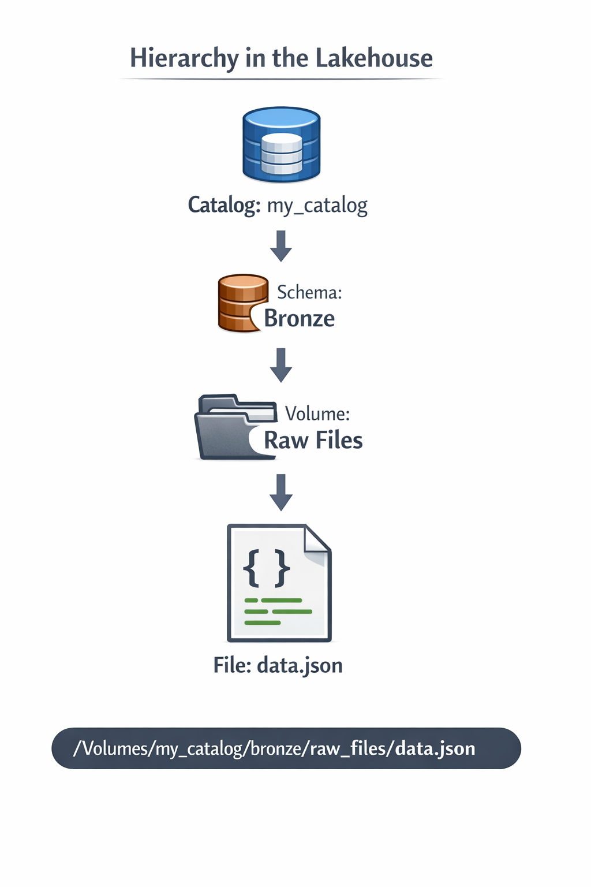
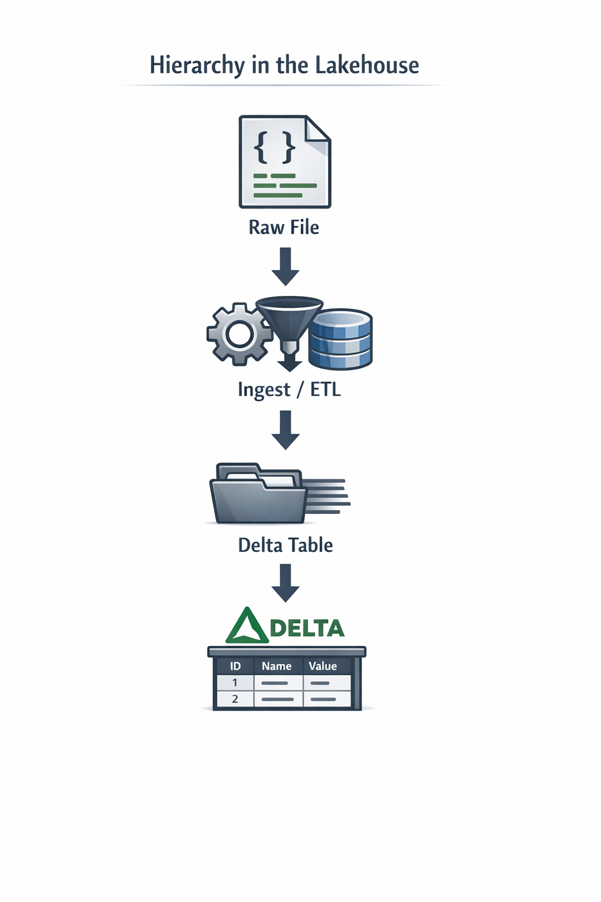

# Querying Files: JSON, CSV & TXT

Reading files directly from volumes in the Lakehouse

## What are volumes?

### Definition
Governed storage space within the Lakehouse
> Managed by Unity Catalog, Access Controlled, Auditable

- **Governed:** Unity Catalog controls who accesses the volume
- **Organized:** Hierarchical structure: Catalog > Schema > Volume

- **Auditable:** Complete log of access and operations

---



---

## Before VS Now

### Before - DBFS
- ✖️ No granular access control
- ✖️ No operational auditing
- ✖️ No integration with Unity Catalog
- ✖️ Difficult to organize at scale
```
dbfs:/FileStore/file.csv
```

### Now - Volumes
- ✅Role-based access control (Unity Catalog)
- ✅Full access auditing
- ✅Integrated enterprise governance
- ✅Structured and scalable organization
```
/Volumes/catalog/schema/volume/file.csv
```

---

## Why do Volumes exist?

### 1. Access Control
Granular permissions by role. Only those who need to have access to the data.

### 2. Organization
Clear structure: Catalog > Schema > Volume > Files.

### 3. Auditing
Automatic logging of who read, wrote, or deleted files.

### 4. Enterprise Environment
Compatible with corporate governance policies.

---

## What can you store on a volume?
Any binary or text file, not just structured data

- JSON: Semi-structured data
- CSV: Flat tabular data
- Parquet: Compressed columnar data
- Images: PNG, JPG, TIFF
- Logs: System logs
- Raw: Unprocessed data

---

## Volumes ≠ Tables

### Volume
**File Storage**
- Files without enforced structure
- Read directly
- Not querable with JOINs
- Layer BEFORE ingestion

### Table (Delta)
**Structured Data**
- Defined schema
- Queryable with full SQL
- Supports JOIN, UPDATE, and DELETE operations
- Layer AFTER ingestion



> Volumes are the starting point, not the final destination.

---
## Querying Data Files (Why?)

### 1. Bronze Layer
Ingests raw data directly from untransformed files.

`Raw files → Bronze table`

### 2. Exploration
Inspects the structure and content of files before processing.

```SQL
SELECT *
FROM json.`...`
```

### 3. Validation
Verifies the quality, format, and completeness of received data.

```SQL
SELECT COUNT(*)
```
FOR AUDITING

---

## Operations: What can you do?

### ✅ YES, you can
- `SELECT` Read and query files
- `JOIN` Combine files with tables
- `WHERE / FILTER` Filter results
- `CREATE TABLE AS` Save results as a Delta table

### ✖️ NO, you can't
- `INSERT INTO` You cannot insert rows into files
- `UPDATE` Files are immutable from SQL
- `DELETE` Does not apply to raw files
- `MERGE` Only to Delta tables

> To modify data: convert the file to a Delta table first

