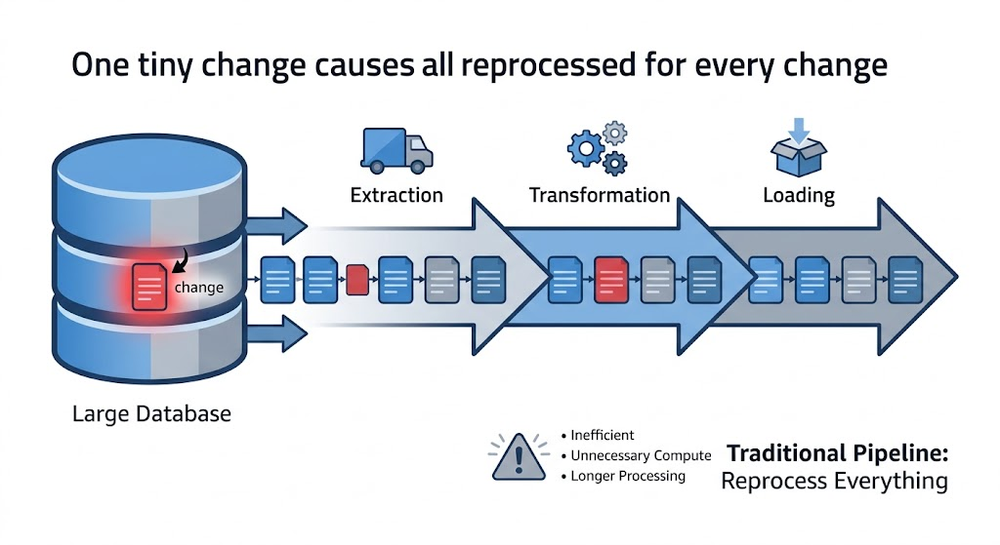
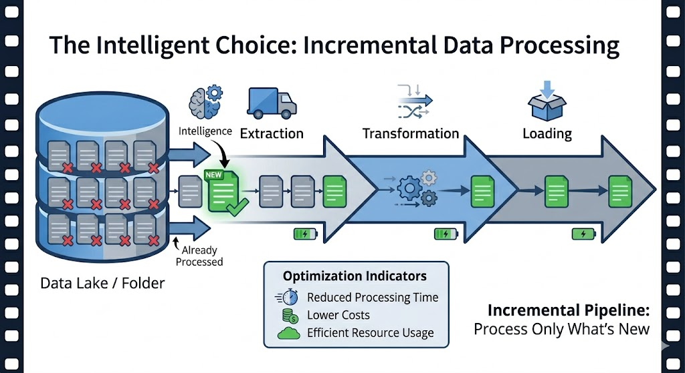
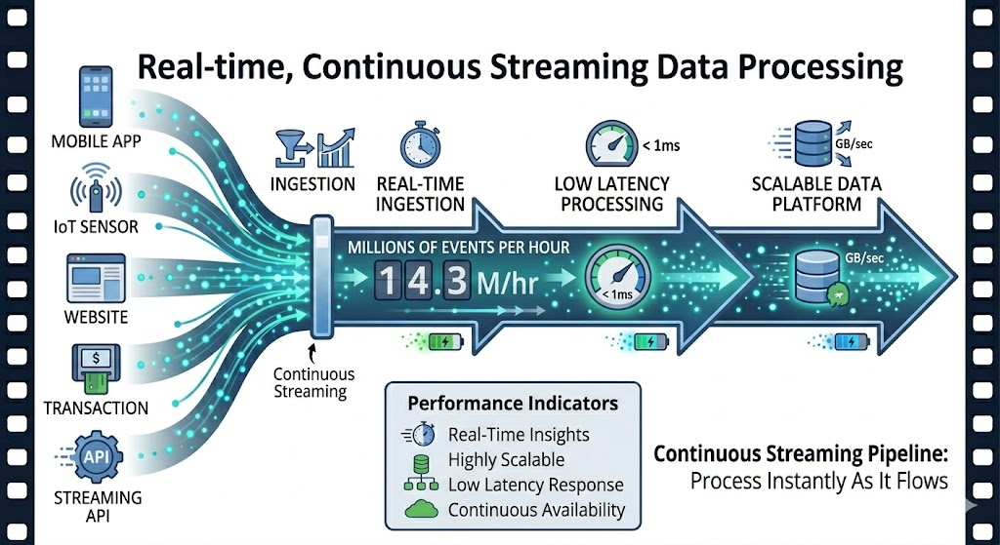
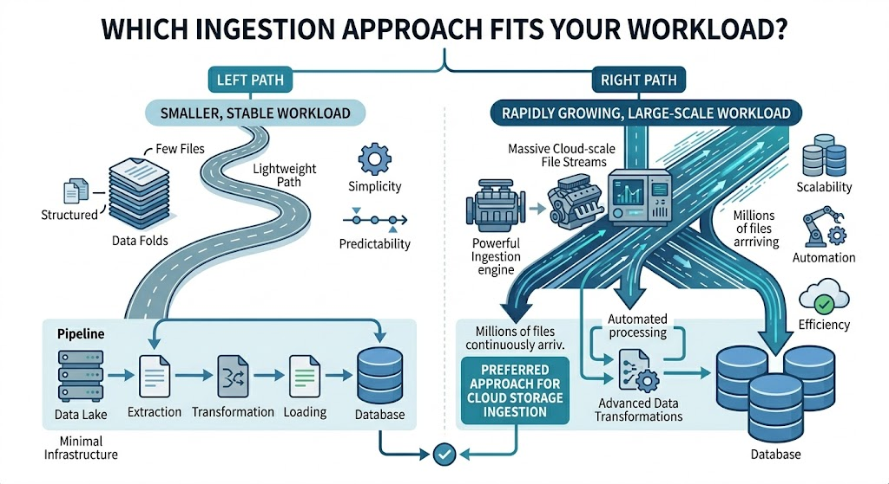

# COPY INTO vs Autoloader

## Which to use for **incremental ingest** to Delta Lake (and why)
- Only new content
- Structured Streaming
- Exactly-Once

---

## Load Only New Data
The challenge isn't loading data, but rather avoiding **reprocessing** what you've already loaded. That's **incremental ingestion**.

- **Traditional Pipeline**: Rereads **all** files every run → expensive, slow, forces deduplication
- **Incremental Ingestion**: Loads only **new** files since the last cycle → less time and resources

### Example



---

## Direct SQL Statement
Loads files into a Delta table in an idempotent and incremental manner: it processes only new files, ignoring those already loaded.

```SQL
COPY INTO my_table
FROM '/path/to/files'
FILEFORMAT = CSV
FORMAT_OPTIONS('delimiter'='|', 'header'='true')
COPY_OPTIONS('mergeSchema'='true')
```

- `mergeSchema`: → enables **schema evolution** if the data changes.

- Simple when the volume is manageable: **thousands of files**.




---

## The Engine for Massive Scale
Built **on top of Spark's Structured Streaming**: processes files as they arrive.

- **Massive Scale:** Billions of files, millions per hour. Unthinkable in normal batch processing.

- **Checkpointing:** Tracks which files have already been processed → guarantees **exactly-once** processing.

- **Fault Tolerance:** If it crashes, it resumes exactly where it left off. No reprocessing or data loss.



---

## The `cloudFiles` Format
Auto Loader's special reader, based on **readStream**.

```python
(spark.readStream
.format("cloudFiles")
.option("cloudFiles.format", "json")
.option("cloudFiles.inferColumnTypes"), "true"
.option("cloudFiles.schemaLocation", "<path>")
.load("/origin/path")

.writeStream
.option("checkpointLocation", "<path>")
.table("destination_table"))
```

### Three Options to Note
- **`cloudFiles.format`:** Format of the source files (JSON, CSV, Parquet, etc.)
- **`cloudFiles.inferColumnTypes`:** Automatically infers column types.

- **`cloudFiles.schemaLocation`:** Saves the inferred schema → avoids re-inferring on each startup.

## About the Schema (Quiz)
- **with types (Parquet):** Extracts the schema directly from the file.

- **without types (JSON/CSV):** Treats everything as a **string**, unless you enable **inferColumnTypes**.

---

## DBFS is deprecated
The book is from 2025 and uses outdated paths. Today, everything points to Unity Catalog Volumes.

### DBFS & mounts (no longer recommended)
> ~~dbfs:/mnt/DEA-Book/checkpoints/...~~
- DBFS root is deprecated
- Mounts `/mnt/...` are deprecated
- New accounts no longer include it.

### Unity Catalog Volume (recommended practice)
> /Volumes/catalog/schema/volume/checkpoint/enrollments
- Governed by Unity Catalog
- Checkpoint and schema location here
- dbfs:/ remains an optional prefix.

> Fine note: the abbreviation `dbfs:/` isn't completely dead; it's still valid as a Volumes prefix. What's deprecated is **specifically** the root and the mounts.

---

## Which to Use?

The decision boils down to two factors: **file volume and scalability**

### COPY INTO (Simple and straightforward SQL)
- Volume: Thousands of files
- Scalability: Less efficient
> Ideal: when the volume is small and predictable.

### Auto Loader (Engine for scaling)
- Volume: Millions of files
- Scalability: Efficient, micro-batches

> **Official** recommendation: Use Auto Loader when ingesting from cloud object storage.

> Rule of thumb:
> Fixed and small → COPY INTO
> 
> Growing, continuous, or large → Auto Loader


