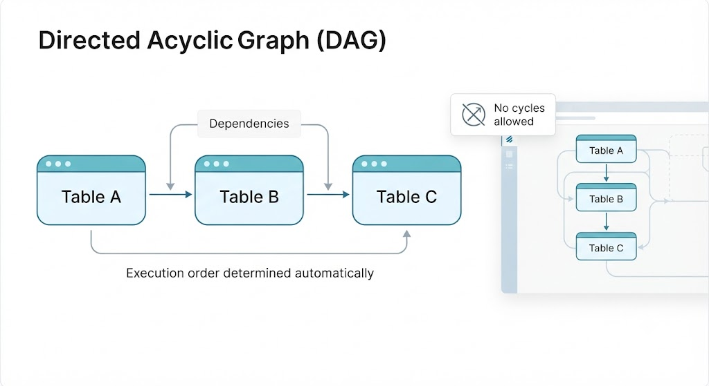

# Delta PivotTables (Lakeflow Declarative Pipelines)

Create data pipelines **declaratively** in **Delta Lake**: you define the **what**, Databricks solves the **how**.

```python
from pyspark import pipeline

@dp.materialized_view
def gold_sales():
    return spark.read.table("silver").groupBy("customer_id").sum("amount")
```

> DLT infers the order, dependencies, and retries.

---

## What is Delta Live Tables?

A Databricks tool for building **declarative** pipelines on **Delta Lake**, reducing the operational work of **ETL** and **ELT**.

### You describe WHAT to transform, Databricks manages:

- Task execution
- Incremental processing
- Pipeline monitoring
- Transformation ordering
- Quality validations
- Failure recovery

> ⚠️ **Nomenclature Note**: Delta Live Tables → Lakeflow Pipelines
> In mid-2025, Databricks rebranded DLT. **The engine and concepts remain the same.**

### Current SQL
```SQL
STREAMING TABLE
MATERIALIZED VIEW
```

Python API
```
dlt → pipelines
from pyspark import pipelines as dp
```


---

## Declarative, not imperative
You describe **the result you want**, not the step-by-step process of how to execute it.

### Imperative (Traditional Spark)
```python
df_bronze = spark.read.table("bronze_orders")

df_silver = (df_bronze.filter("order_id IS NOT NULL"))

df_gold = (df_silver.groupBy("customer_id").sum("amount"))

df_gold.write.mode("overwrite").saveAsTable("gold_sales")
```

> You tell the system **how** to do the work and in what order.

### Declarative (DLT)
```python
@dp.materialized_view
def silver_orders():
    return (spark.read.table("bronze_orders").filter("order_id IS NOT NULL"))

@dp.materialized_view
def gold_sales():
    return (spark.read.table("silver_orders").groupBy("customer_id").sum("amount"))
```

> You declare **which** table you want; DLT infers the order, dependencies, checkpoints, and retries.

---

Why Does DLT Exist?

Imagine a **Medallion** architecture. Without DLT, all the operational work falls on you.

- Bronze: Raw data ingested
- Silver: Cleaned and validated
- Gold: Aggregated for business use

### ⚠️ Without DLT you would have to...
1. Create Spark notebooks or scripts
2. Configure jobs to run them
3. Manage dependencies between tasks
4. Implement quality assurance checks
5. Configure monitoring and alerts
6. Handle errors and retries

> ✅ With DLT: **you only define the tables and their transformations.**

---

## Declarative Tables
Instead of specifying **how** to execute each step, you define the **tables you want to generate**.

- You write **less code** → less complexity and less development time.

- You declare a **customers** table that depends on **raw.customers**.

`pipeline.py`
```python
from pyspark import pipelines as dp

@dp.materialized_view
def customer():
    return spark.read.table("raw.customers")
```

`pipeline.sql`
```SQL
CREATE OR REFRESH MATERIALIZED VIEW customers AS
SELECT * FROM raw.customers;
```
---
## Automatic Dependencies
If one table reads from another, DLT **detects the dependency** and executes in the correct order. You don't configure it.

```python
@dp.materialized_view
def silver_order(): return spark.read.table("bronze_orders")
@dp.materialized_view
def gold_sales():
    return spark.read.table("silver_orders")
```

```sql
CREATE OR REFRESH MATERIALIZED VIEW silver_orders AS SELECT * FROM bronze_orders;

CREATE OR REFRESH MATERIALIZED VIEW gold_sales AS SELECT * FROM silver_orders;
```

### DLT detects:
bronze_orders → silver_orders → gold_sales
> And executes each step in the **correct order.**

---

## DAGs (Directed Acyclic Graphs)
DLT uses a **DAG** to understand which table depends on which and decide the execution order.

- A map of arrows that **never forms a cycle**: A → B → C.
- DLT **reads the dependencies** and decides the order automatically.

- That's why you see the tables **visually connected** in the pipeline.



---

## Data Quality **Expectations**
You define **rules that the data must meet** and decide what to do with rows that don't meet them.

> ✅ This rule checks that the `amount` is greater than zero.

- `@dp.except`
- `@dp.expect_or_drop`
- `@dp.excect_or_fail`

`quality.py`
```python
@dp.table
@dp.expect("valid_amount", "amount> 0")
def sales():
    return spark.read.table("raw.sales")
```

`quality.sql`
```sql
CREATE OR REFRESH STREAMING TABLE sales (
    CONSTRAINT valid_amount EXPECT (amount > 0)
) AS SELECT * FROM STREAM (raw.sales);
```

---

## DLT vs Spark Structured Streaming
They are not interchangeable: **DLT uses Structured Streaming underneath**. The difference lies in the **level of abstraction**.

`Delta Live Tables`: declarative layer **built on top of** → `Spark Structured Streaming`

### `Structured Streaming` (You control everything)

`streaming.py`
```python
stream = (spark.readStream.format("cloudFiles").option("cloudFiles.format", "json").load("/raw/orders"))

(stream.writeStream.option("checkpointLocation", "/checkpoint/orders").trigger(processingTime="1 minute").toTable("bronze_orders"))
```

You must decide:
- Checkpoints
- Dependencies
- Errors
- Triggers
- Monitoring
- Quality
Maximum control, but also **more responsibility**.

> This block **cannot be written in SQL alone**: registering streaming tables requires PySpark. Just one advantage of DLT.

---

## A Real-World Example
raw_orders → bronze_orders → silver_orders → gold_sales

### With Structured Streaming
Job 1 → bronze
Job 2 → silver
Job 3 → gold

And you must ensure:
- That Job 2 waits for Job 1, and that Job 3 waits for Job 2
- That all jobs have checkpoints
- That they restart properly if they fail.

### With DLT (just clarify)
```python
@dp.table
def bronze_orders():
    return spark.readStream.format("cloudFiles").option("cloudFiles.format", "json").load("/raw/orders")

@dp.materialized_view
def silver_orders():
    return spark.read.table("bronze_orders")

@dp.materialized_view
def gold_sales():
    return spark.read.table("silver_orders")
```

> DLT builds the DAG and executes everything in the **correct order.**

---

## Three Types of Objects in DLT
All are **dataset declarations**, but they differ in how they are materialized and processed.

### Streaming Table (`@dp.table`)
Processes data **incrementally**: each row is read and processed only once.
> Ingestion Base: Bronze layer

### Materialized View (`@dp.materialized_view`)
**Materialized** dataset: pre-calculated and updated results.
> Most common in: Silver and Gold

### Temporary View (`@dp.temporary_view`)
**NON-materialized** logical transformation. Not stored in the catalog.
> Serves as: Logical intermediate step

--- 

## Streaming Table 
Processes data **incrementally**: Each input row is read and processed **only once**. Basis of near real-time ingestion and processing.

### Features
- Streams data **incrementally**
- Automatically uses **checkpoints**
- Only processes **new data** since the last run
- Streaming source: **Auto Loader**, append-only table
- Based on the Bronze Layer and low latency

`bronze.py`
```python
from pyspark import pipelines as dp

@dp.table
def bronze_orders():
    return (spark.readStream.format("cloudFiles").option("cloudFiles.format", "json").load("/raw/orders"))
```

`bronze.sql`
```sql
CREATE OR REFRESH STREAMING TABLE bronze_orders AS SELECT * FROM cloud_files("/raw/orders", "json");
```

---

## Materialized View 

Materialized datasets whose results are pre-calculated and kept up-to-date. The engine attempts to refresh it incrementally whenever possible.

### Features
- Physically stored in Delta Lake **(persistent)**
- Accepts sources that are updated/deleted **(not append-only)**
- You don't modify its data: the query defines the output
- The most common are Silver and Gold **(enrich, append)**

`silver.py`
```python
@dp.materialized_view
def silver_orders():
    return spark.read.table("bronze_orders")
```

`silver.sql`
```sql
CREATE OR REFRESH MATERIALIZED VIEW silver_orders AS SELECT * FROM bronze_orders;
```

> Formerly called a **Live Table**.

---

## Temporary View
A logical transformation that is **NOT materialized**. It exists only within the pipeline and is not stored in the catalog. In the workbook, it appears as a **live view**.

### Features
- It is not persisted as a **physical table**
- It only exists within the **pipeline scope**
- It is used as a logical **intermediate step**
- It organizes the DAG and serves for **quality checks**

`intermediate.py`
```python
@dp.temporary_view
def filtered_orders():
    return (spark.read.table("bronze_orders").filter("amount > 0"))
```

`intermediate.sql`
```sql
CREATE TEMPORARY LIVE VIEW filtered_orders AS
SELECT * FROM bronze_orders
WHERE amount > 0;
```

> ⚠️ It does not appear in the catalog: it is **only logic** within the pipeline

---

## The three types at a glance

| Feature                                  | **Streaming Table**                      | **Materialized View**                 | **Temporary View**                          |
| ---------------------------------------- | ---------------------------------------- | ------------------------------------- | ------------------------------------------- |
| **Purpose**                              | Continuously ingest and process new data | Store the latest computed results     | Create intermediate logical transformations |
| **How it processes data**                | Incrementally (only new rows)            | Refreshes incrementally when possible | Executes as part of the pipeline logic      |
| **Data is stored?**                      | ✅ Yes                                    | ✅ Yes                                 | ❌ No                                        |
| **Persistent in Delta Lake**             | ✅ Yes                                    | ✅ Yes                                 | ❌ No                                        |
| **Appears in Catalog**                   | ✅ Yes                                    | ✅ Yes                                 | ❌ No                                        |
| **Typical use case**                     | Bronze layer ingestion                   | Silver and Gold transformations       | Intermediate steps and data quality checks  |
| **Supports updates/deletes from source** | ❌ No (append-only sources)               | ✅ Yes                                 | Depends on the source used                  |
| **Processes only new data**              | ✅ Yes                                    | ❌ Refreshes based on query changes    | ❌ Recomputed during pipeline execution      |
| **Latency**                              | Low (near real-time)                     | Batch or incremental refresh          | Pipeline execution only                     |
| **Common data source**                   | Auto Loader, append-only tables          | Streaming tables or Delta tables      | Any table or view within the pipeline       |
| **Best for**                             | Data ingestion                           | Curated datasets for analytics        | Simplifying the DAG and reusable logic      |

> Streaming table and Materialized view **are persisted**; Temporary view is **just logic** within the pipeline.

---

## Expectations: The Three Actions (Quality Control)
Name + Condition that must be true + Action if violated

### 🟠 Warn (Default Action)
Records the violation in metrics, but **allows the row to pass**.

> The bad row **DOES** pass. "I see you, but it passes."

### 🔴 Drop (Most used for cleaning)
Discards rows that **violate the rule**.

> ✖️ The bad row **is dropped**. "You don't pass."

### ⚫ Fail (Critical Correction)
Causes **the entire pipeline to fail** upon any violation.

> ✖️ Everything **stops**. "Everything is canceled."

### > ⚠️ **The classic exam trap:** the default **(warn)** DOES NOT drop anything. Many people think it drops the row. **No: she keeps it and reports it**.

---

## Expectations in Code

### 🟠 Warn (Allow to proceed + report)
**python**
```python
@dp.expect(
    "valid_id","enroll_id IS NOT NULL"
)
```

**sql**
```sql
CONSTRAINT valid_id EXCEPT (enroll_id IS NOT NULL) 
-- (Without ON VIOLATION)
```

### 🔴 Drop (Remove the bad row)
**python**
```python
@dp.expect_or_drop(
    "valid_id",
    "enroll_id IS NOT NULL"
)
```

**sql**
```sql
CONSTRAINT valid_id
EXPECT (...)
ON VIOLATION DROP ROW
```

### ⚫ Fail (Stop the pipeline)
**python**
```python
@dp.expect_or_fail(
    "valid_id",
    "enroll_id IS NOT NULL"
)
```

**sql**
```sql
CONSTRAINT valid_id
EXPECT (...)
ON VIOLATION FAIL UPDATE
```

### > ⚠️**Multiple at once** in Python: `@dp.expect_all` / `_all_or_drop` / `_all_or_fail` with a dictionary. In SQL, separate each **CONTRAINT** with a comma.

### 🟠 expect: Allow to proceed + report
### 🔴 _or_drop: Drop the row
### ⚫_or_fail: Fail the update