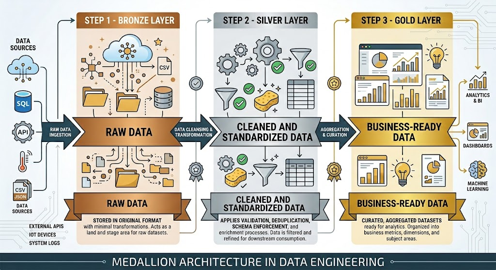

# Medallion Architecture
Three layers **(Bronze, Silver and Gold)** that improve data quality as it moves through the Data Lakehouse.

## What is Medallion Architecture?

A design pattern for organizing data within a **Data Lakehouse** using three successive layers.

Data **improves in quality** and becomes increasingly **business-ready** as it moves between layers.

> ### Data Lakehouse
> Combines the flexibility of a **data lake** with the structure and governance of a **data warehouse**. Medallion is how it's organized internally.

### 1. Bronze (raw data)
Raw data, exactly as it came from the source. The source of truth. 

### (Quality)

### 2. Silver (clean & standardized)
Clean, validated, and reliable data, ready for reuse.

### (Business value)

### 3. Gold (business-ready)
Business-ready KPIs, aggregations, and models.




---

## Bronze Layer (the raw data)
Data enters **exactly as it arrives** from its original source, untouched. Nothing is cleaned or transformed.

> The idea is to have a faithful copy of everything that arrives: your **source of truth**. If something goes wrong later, you can always revert to the original, untouched data.

- Faithful copy of the source (Source of truth)
- Allows **reprocessing** without requesting the data again
- Maintains end-to-end **traceability**.

---

## Dos and Don'ts in Bronze
API → Bronze (without any modifications)
```json
{
    "id": "123",
    "message": "New Project",
    "created_time": "2026-06-27T10:30:00Z",
    "likes": "100" //string
}
```

> Even if `likes` comes as a string and there's inconsistent data, in Bronze, **it's not usually corrected.**

### What IS done
- **Engineer from** APIs, CSV, SFTP, GCS...
- **Maintain the** original schema
- **Add metadata:** ingestion_date, source_file
- Partitioning **to facilitate queries**

### What IS NOT done
- Remove duplicates
- Change data types
- Apply business rules
- Create metrics or aggregations

---

## Silver Layer (Clean and Reliable Data)
The data is no longer raw and becomes **clean, standardized, and reliable data.**
- Bronze: data **as received**
- Silver: data **corrected and ready for reuse**

> This is the **first layer where the data is processed: it is cleaned, validated, and standardized.**

---

## From Bronze to Silver: Clean and Standardize

### Typical Transformations
- Clean null or invalid values
- Convert data types
- Remove duplicates
- Standardize names and formats
- Validate quality rules
- Enrich and create reusable entities

> **For interviews:** Silver is where data is **cleaned, validated, and standardized** to become reliable and reusable.

---

## Gold (Business-Ready Data)
The data has already been **transformed and modeled** to answer business questions.

- **Bronze:** What came in?

- **Silver:** What data is reliable?

- **Gold:** What does the business need?

> Here, the data is **aggregated and summarized:** many records are converted into a few valuable metrics.

---

## From Silver to Gold: Aggregating for Business

### What's Built in Gold
- **KPIs** and Business Metrics
- **Aggregations and Summaries**
- Tables for **Dashboards**
- Data Marts and Dimensional Models
- Datasets for **Machine Learning**

### Silver → Gold: From Individual Records to Business Metrics

The **Silver** layer contains clean, standardized, row-level data. Each record represents a single business event (for example, a social media publication).

**Silver (Individual Rows)**

| post_id | published_date | platform | account | impressions | engagements | clicks |
|---------:|----------------|----------|---------|------------:|------------:|-------:|
| 1001 | 2026-06-01 | LinkedIn | Corporate | 5,420 | 312 | 48 |
| 1002 | 2026-06-01 | LinkedIn | Careers | 3,180 | 201 | 35 |
| 1003 | 2026-06-01 | Instagram | Brand | 8,950 | 724 | 91 |
| 1004 | 2026-06-02 | Instagram | Brand | 7,840 | 655 | 84 |
| 1005 | 2026-06-02 | X | Corporate | 2,410 | 118 | 19 |

> At the Silver layer, every row represents an individual publication with validated and standardized attributes.

---

**Gold (Aggregated Business Metrics)**

| Date | Platform | Total Posts | Total Impressions | Total Engagements | Avg. Engagement Rate |
|------|----------|------------:|------------------:|------------------:|---------------------:|
| 2026-06-01 | LinkedIn | 2 | 8,600 | 513 | 5.97% |
| 2026-06-01 | Instagram | 1 | 8,950 | 724 | 8.09% |
| 2026-06-02 | Instagram | 1 | 7,840 | 655 | 8.35% |
| 2026-06-02 | X | 1 | 2,410 | 118 | 4.90% |

> **In Gold, individual publications are no longer the focus; instead, the metrics consumed by the business are what matter.**

The Gold layer transforms detailed records into business-ready KPIs, dashboards, and reporting datasets that support decision-making.

> In Gold, individual publications are no longer the focus; instead, **the metrics consumed by the business** are what matter.

---

## Each layer answers a question:

### Bronze (Raw Data)
**What data arrived?** A faithful copy of the source, untransformed. Your true source.

### Silver (Clean & Standardized)
**What data is accurate and reliable?** Clean, valid, and standardized data, ready for reuse.

### Gold (Business-ready)
**What information does the business need?** KPIs, aggregations, and models that feed dashboards and machine learning.

> Higher quality and greater business value at every step: Bronze → Silver → Gold