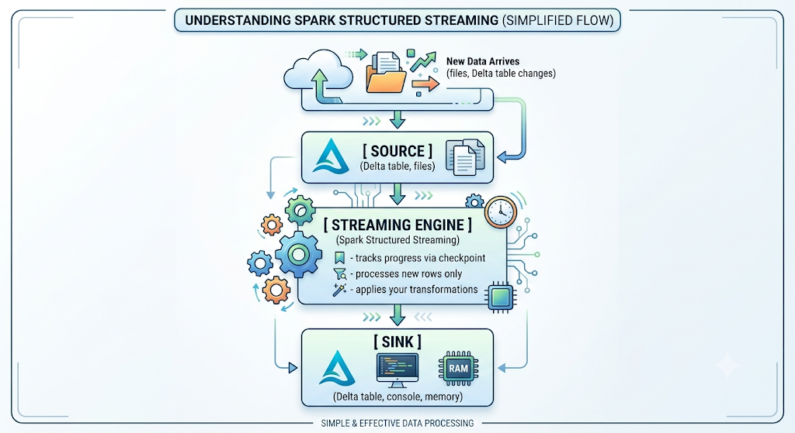
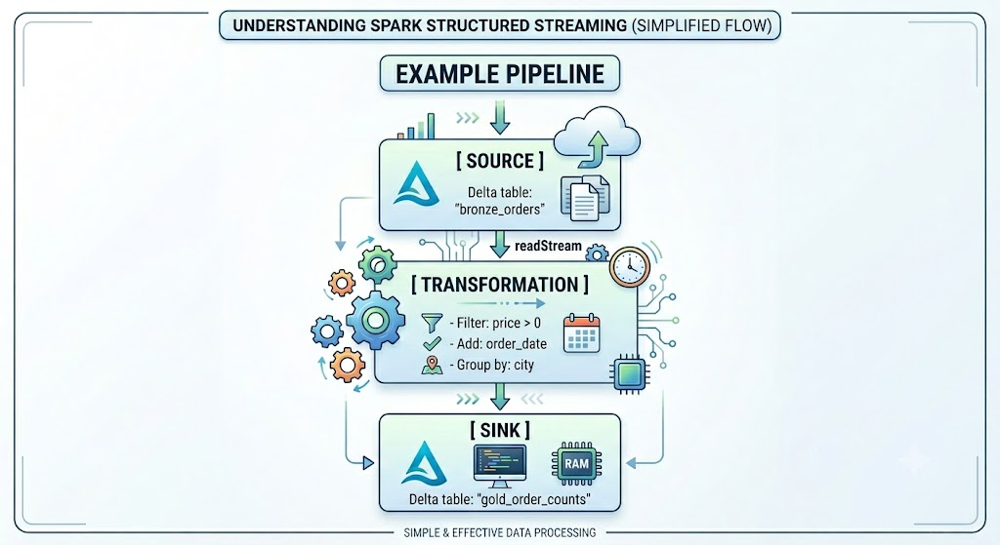

# Structured Streaming with Delta Lake

Spark Structured Streaming lets you process data as it arrives — continuously, reliably, and with the same familiar DataFrame/SQL API you already use for batch jobs. Instead of running a job on a fixed file, you run a query on a stream that never ends. This guide covers the core concepts, hands-on code patterns, and everything you need to know for the Databricks Certified Data Engineer Associate exam.

---

## What is Structured Streaming?

Structured Streaming is Spark's engine for processing **continuously arriving data**. It treats a stream of data as a table that grows over time — new rows are appended as new data arrives, and your query runs automatically against each new batch.

It is built on top of the same Spark SQL engine used for batch processing, so you can use the same DataFrame operations and SQL syntax you already know.

### Key Idea: The Infinite Table

Imagine a regular database table — it has rows, columns, and a schema. Now imagine that table **never stops growing**: every few seconds, new rows arrive at the bottom. That's the mental model for Structured Streaming.

```text
Time ──────────────────────────────────────────▶
Regular Table:       [Row 1] [Row 2] [Row 3]    ← fixed, finite
Streaming Table:     [Row 1] [Row 2] [Row 3] [Row 4] [Row 5] ...
                                                            ↑ keeps growing
```

Spark doesn't process all rows each time. It remembers where it left off and only processes the **new rows** that arrived since the last run.

### Visual Model




### Why It Matters

Without Structured Streaming, you would need to schedule batch jobs and manually track which data was already processed. Structured Streaming handles all of that automatically — it tracks progress, recovers from failures, and ensures no data is missed or processed twice.

---

## The Infinite Table Concept

Spark models a data stream as an **unbounded table** — a table that has no final row count because new rows keep arriving over time.

When you write a query against this infinite table, Spark does not try to read everything at once. Instead, it:

1. Reads only the **new rows** since the last trigger
2. Applies your transformations to those rows
3. Writes the results to the output (sink)
4. Saves its progress (checkpoint)
5. Repeats when the next trigger fires

```text
Infinite Input Table (grows over time):
┌──────────┬──────────┬────────┐
│ order_id │ product  │ price  │
├──────────┼──────────┼────────┤
│ 001      │ Laptop   │ 999    │  ← already processed
│ 002      │ Mouse    │ 29     │  ← already processed
│ 003      │ Keyboard │ 79     │  ← already processed
│ 004      │ Monitor  │ 349    │  ← NEW → processed in next trigger
│ 005      │ Webcam   │ 89     │  ← NEW → processed in next trigger
│ ...      │ ...      │ ...    │  ← more arriving soon
└──────────┴──────────┴────────┘
```

### Real-World Example

Think of a food delivery app. Every time a customer places an order, a new record lands in a Delta table. A Structured Streaming query watches that table — the moment new orders arrive, it picks them up, calculates metrics (orders per city, revenue per hour), and writes results to a dashboard table. It does this **automatically**, without you needing to re-run anything.

---

## Anatomy of a Stream

Every streaming pipeline has exactly three parts: a **source**, one or more **transformations**, and a **sink**.

### Source

The source is where streaming data comes from. In Databricks, the most common sources are:

- **Delta tables** — the preferred source; uses the Delta transaction log to track new rows
- **Auto Loader** (`cloudFiles`) — watches a cloud storage folder for new files
- **Kafka** — for enterprise event streams (not available in Community Edition)

The source must be **replayable** — meaning if the job fails, it can re-read the same data again from the last checkpoint.

### Transformation

Transformations are the operations you apply to the incoming data — filters, joins, aggregations, column derivations. They work exactly like batch DataFrame operations, with a few exceptions (covered in the Limitations section of the lab guide).

### Sink

The sink is where results are written. Common sinks in Databricks:

- **Delta table** — most common; gives ACID transactions and downstream streaming support
- **Console** — useful for testing and debugging
- **Memory** — stores results in memory as a temporary table (testing only)

### Example Pipeline



---

## Micro-Batch Processing

Structured Streaming uses a **micro-batch** model by default. Instead of processing one record at a time (which would be very slow), it groups new records into small batches and processes each batch together.

### How It Works

```text
Step 1: Trigger fires (e.g., every 30 seconds)
Step 2: Engine checks source for new data since last checkpoint
Step 3: New rows are collected into a micro-batch DataFrame
Step 4: Transformations are applied to the micro-batch
Step 5: Results are written to the sink
Step 6: Checkpoint is updated ("I processed up to row N")
Step 7: Wait for next trigger → go to Step 1
```

### Example Timeline

```text
Trigger Type: processingTime = "30 seconds"

00:00 → Trigger 1 fires
         New rows found: 47
         Processed and written ✅
         Checkpoint saved

00:30 → Trigger 2 fires
         New rows found: 83
         Processed and written ✅
         Checkpoint saved

01:00 → Trigger 3 fires
         New rows found: 0
         Nothing to process, skipped

01:30 → Trigger 4 fires
         New rows found: 31
         Processed and written ✅
```

Each trigger processes **only the new rows** — rows from Trigger 1 are never re-read in Trigger 2.

### Certification Tip

> The exam often asks: *"What is a micro-batch in Structured Streaming?"*
>
> Answer: A micro-batch is a small, bounded set of new records collected from the source during one trigger interval. Spark processes each micro-batch as if it were a regular batch job, then repeats for the next interval.

---

## `spark.read` vs `spark.readStream`

This is one of the most commonly tested distinctions in the exam.

### Batch Reading

```python
# Reads the entire table ONCE, right now, as a fixed snapshot
df = spark.read.table("courses")
```

`spark.read` performs a one-time read of all data currently in the table. It returns a regular (batch) DataFrame. The data is fixed — if new rows are added to the table after this line runs, they are **not** reflected in `df`.

### Streaming Reading

```python
# Sets up a continuous read — picks up NEW rows on every trigger
stream_df = spark.readStream.table("courses")
```

`spark.readStream` creates a **streaming DataFrame** — it represents a continuously updated view of the table. No data is actually read yet (lazy execution). Data will be read incrementally each time the stream's trigger fires.

### Comparison Table

| Feature | `spark.read` | `spark.readStream` |
|---|---|---|
| Processing type | Batch — one-time | Streaming — continuous |
| Data arrival | Fixed snapshot | New rows on each trigger |
| Execution | Immediate | Lazy — needs a sink to start |
| `isStreaming` | `False` | `True` |
| Supports `show()` | ✅ Yes | ❌ No |
| Supports `count()` | ✅ Yes | ❌ No |
| Supports `sort()` | ✅ Yes | ❌ No |
| Use cases | Reports, one-off analysis | ETL pipelines, dashboards |

### Exam Tip

> The exam may give you code and ask whether it will run successfully. If you see `spark.readStream` followed by `.show()`, `.count()`, or `.sort()` — that code will **fail**. Those operations require seeing all data, which is impossible on an infinite stream.

---

### The Most Important Limitation: `processingTime`

On serverless compute (which Community Edition uses), the `processingTime` trigger — which keeps a stream running forever — is **not supported**. If you try to use it, you will see:

```
INFINITE_STREAMING_TRIGGER_NOT_SUPPORTED
```

**Always use `availableNow=True`** in Community Edition. It processes all pending data and stops cleanly, which is also the correct pattern for scheduled incremental jobs.

### Practical Impact

- Use `availableNow=True` for every streaming write
- Use `/FileStore/` or `/Volumes/` paths instead of `/tmp/`
- All Delta Lake features (time travel, schema enforcement, ACID) work normally
- The streaming concepts you learn are identical to production — only the trigger type differs

---

## Creating a Streaming DataFrame

### The Source Table

Before creating a stream, you need a Delta table to read from. Here's a simple example:

```python
# Create a courses table to use as our streaming source
spark.sql("""
    CREATE TABLE IF NOT EXISTS courses (
        course_id    INT,
        title        STRING,
        instructor   STRING,
        price        DOUBLE,
        category     STRING
    )
    USING DELTA
""")

# Insert some initial data
spark.sql("""
    INSERT INTO courses VALUES
        (1, 'Python Basics',      'Alice',   49.99, 'Programming'),
        (2, 'SQL for Analysts',   'Bob',     39.99, 'Data'),
        (3, 'Spark Fundamentals', 'Alice',   89.99, 'Data'),
        (4, 'ML with Sklearn',    'Carol',   99.99, 'Machine Learning'),
        (5, 'Deep Learning',      'Carol',  129.99, 'Machine Learning')
""")

print("Source table ready")
spark.table("courses").show()
```

### Read from Delta Table as a Stream

```python
# Create a streaming DataFrame from the Delta table
stream_df = (
    spark
    .readStream          # (1) tell Spark this is a streaming read
    .table("courses")    # (2) which Delta table to watch
)
```

**Line by line:**

| Line | What it does |
|---|---|
| `spark.readStream` | Returns a `DataStreamReader`. From here, everything is streaming. |
| `.table("courses")` | Specifies the Delta table to use as the source. Spark will track new rows using the Delta transaction log. |

Nothing happens yet — this is **lazy execution**. Spark sets up the plan but does not read any data until you define a sink and call `.start()`.

---

## Verifying a Stream

### Using `isStreaming`

```python
# Check whether a DataFrame is a streaming DataFrame
print(stream_df.isStreaming)   # → True

# Compare with a batch DataFrame
batch_df = spark.read.table("courses")
print(batch_df.isStreaming)    # → False
```

`isStreaming` returns `True` if the DataFrame was created with `readStream`, and `False` if it was created with `spark.read`. This is a quick way to verify you're working with a streaming DataFrame before proceeding.

### Why It Matters

Many operations behave differently — or fail entirely — on streaming DataFrames. Checking `isStreaming` helps you catch mistakes early, especially when a function accepts a DataFrame as input and you need to know which processing path to take.

```python
def process(df):
    if df.isStreaming:
        print("Streaming mode: using writeStream")
    else:
        print("Batch mode: using write")
```

---

## Lazy Execution in Streaming

When you write `spark.readStream.table("courses")`, Spark does **not** read any data. It builds an execution plan — a description of what should happen — but doesn't execute it.

```text
stream_df = spark.readStream.table("courses")
     ↑
   No data read yet. Just a plan.

stream_df.filter(col("price") > 50)
     ↑
   No data filtered yet. Plan extended.

stream_df.writeStream.start(...)
     ↑
   NOW Spark executes the plan and starts the stream.
```

This is called **lazy evaluation**. The stream only starts when you call `.start()` or `.toTable()` on the `writeStream`. This lets Spark optimize the full pipeline before running anything.

**Common mistake:** Writing transformations on a streaming DataFrame and wondering why nothing is happening. You must call `.writeStream...start()` to trigger execution.

---

## SQL Workflow

The SQL workflow uses temporary views to bridge between PySpark streaming DataFrames and SQL queries.

### Step 1 — Create Temporary View

```python
# Register the streaming DataFrame as a SQL-accessible temporary view
stream_df.createOrReplaceTempView("courses_stream")
```

`createOrReplaceTempView` makes the streaming DataFrame available under a name in Spark SQL. The view is **temporary** — it exists only for the current Spark session and is not stored anywhere on disk.

> **Important:** The view is still streaming. Any SQL query against `courses_stream` will produce a streaming result, not a batch result.

### Step 2 — Transform with SQL

```python
# Filter: only courses that cost more than $50
filtered_query = spark.sql("""
    SELECT
        course_id,
        title,
        instructor,
        price,
        category
    FROM courses_stream
    WHERE price > 50
""")

print("Is filtered result streaming?", filtered_query.isStreaming)  # → True
```

The SQL `SELECT` runs against the streaming view and returns a new streaming DataFrame. You can use any standard SQL clauses: `WHERE`, `JOIN`, `CASE WHEN`, `WITH`, etc.

---

## SQL Transformations

SQL transformations on a streaming view work exactly like batch SQL, with the same unsupported exceptions (no `ORDER BY`, no `DISTINCT`, no subqueries that require full scans).

### Filter Example

```sql
-- Keep only Data category courses priced above $50
SELECT
    course_id,
    title,
    instructor,
    price
FROM courses_stream
WHERE category = 'Data'
  AND price > 50
```

### Derived Column Example

```sql
-- Add a discount price column
SELECT
    course_id,
    title,
    price,
    ROUND(price * 0.85, 2) AS discounted_price,  -- 15% off
    CASE
        WHEN price >= 100 THEN 'Premium'
        WHEN price >= 50  THEN 'Mid-Range'
        ELSE                   'Budget'
    END AS price_tier
FROM courses_stream
```

---

## Aggregation Example

Aggregations on streams require `complete` output mode (covered in the Output Modes section). Here's the pattern:

### Count Courses by Instructor

```python
# SQL aggregation on the streaming view
agg_query = spark.sql("""
    SELECT
        instructor,
        COUNT(*)        AS total_courses,
        ROUND(AVG(price), 2) AS avg_price,
        MIN(price)      AS cheapest,
        MAX(price)      AS most_expensive
    FROM courses_stream
    GROUP BY instructor
""")

print("Is aggregation streaming?", agg_query.isStreaming)  # → True
```

The result is a streaming DataFrame where each row represents one instructor's running totals. As new courses are inserted into the source table, these counts update automatically on the next trigger.

---

## Returning to a DataFrame from SQL

After writing a stream to a Delta table, you can read the result back as a batch DataFrame for validation or display.

```python
# After writing stream results to "courses_summary" Delta table...
result_df = spark.table("courses_summary")

# Now you can use all batch operations
result_df.show()
result_df.count()
result_df.orderBy("total_courses", ascending=False).show()
```

> `spark.table("courses_summary")` is a **batch** read. It reads the current state of the table as a snapshot. To query the latest results, re-run this line after new data has been processed.

---

## Writing Streams with `writeStream`

Every streaming pipeline must end with a `writeStream` call. Without a sink, no data is ever processed — lazy execution means nothing runs until you define where results should go.

### Basic Syntax

```python
query = (
    result_df
    .writeStream                                # (1) start write configuration
    .format("delta")                            # (2) output format
    .outputMode("complete")                     # (3) how to write results
    .option("checkpointLocation", chk_path)    # (4) fault tolerance
    .trigger(availableNow=True)                 # (5) when to process
    .toTable("courses_summary")                 # (6) destination table — starts the stream
)

query.awaitTermination()                        # (7) wait for stream to finish
```

**Line by line:**

| Line | Purpose |
|---|---|
| `.writeStream` | Opens the `DataStreamWriter` configuration. |
| `.format("delta")` | Write results as a Delta table (recommended for all Databricks streaming). |
| `.outputMode("complete")` | Because this query has a `GROUP BY`, use `complete` mode (rewrite full result each trigger). |
| `.option("checkpointLocation", ...)` | Where to save stream progress. Required for fault tolerance. |
| `.trigger(availableNow=True)` | Process all available data and stop. Correct for Community Edition. |
| `.toTable("courses_summary")` | The destination Delta table. Calling this **starts** the stream. |
| `query.awaitTermination()` | Blocks the notebook cell until the stream finishes (needed with `availableNow`). |

### Why a Sink Is Required

The sink is what causes Spark to actually execute the streaming pipeline. Before the sink is defined, everything is just a plan. The sink also determines:

- **Where** results are stored
- **How** results are written (`outputMode`)
- **When** processing happens (`trigger`)
- **How** failures are recovered (`checkpointLocation`)

---

## Checkpointing

### What Is a Checkpoint?

A checkpoint is a folder in storage where Spark saves its streaming progress. It stores:

- **Offsets** — which rows from the source have been read
- **Commits** — which micro-batches have been successfully written to the sink
- **State** — for stateful operations like aggregations

```text
/FileStore/checkpoints/courses_summary/
├── commits/
│   ├── 0          ← "batch 0 written successfully"
│   └── 1          ← "batch 1 written successfully"
├── offsets/
│   ├── 0          ← "batch 0 read rows 1–47 from source"
│   └── 1          ← "batch 1 read rows 48–89 from source"
├── metadata        ← stream configuration
└── sources/        ← source-specific tracking state
```

### Why It Matters

Without a checkpoint, a restarted stream cannot know where it left off. It would have two bad options:

- **Start from the beginning** → reprocess all data → write duplicates
- **Start from now** → skip unprocessed data → lose records

With a checkpoint, the stream resumes exactly from the last committed offset — no duplicates, no data loss.

### Example

```python
import os

# Define a unique checkpoint path for each streaming query
BASE_PATH   = "/FileStore/streaming_lab"
CHECKPOINT  = f"{BASE_PATH}/checkpoints/courses_summary"

query = (
    agg_df
    .writeStream
    .format("delta")
    .outputMode("complete")
    .option("checkpointLocation", CHECKPOINT)   # ← required
    .trigger(availableNow=True)
    .toTable("courses_summary")
)
query.awaitTermination()
```

> **Each streaming query must have its own unique checkpoint path.** Sharing a checkpoint between two different queries corrupts both. Name your checkpoints to match the output table (e.g., `checkpoints/courses_summary`).

### Recovery Scenario

```text
Trigger 1: reads rows 1–47  → writes to sink → checkpoint saved ✅
Trigger 2: reads rows 48–89 → writes to sink → checkpoint saved ✅
Trigger 3: reads rows 90–?  → CLUSTER CRASHES mid-write ❌

On restart:
→ Spark reads checkpoint: "last committed = Trigger 2, offset 89"
→ Re-reads rows 90–? from source (replayable Delta table)
→ Writes to sink (Delta's idempotent writes prevent duplicates)
→ Checkpoint updated ✅
```

### Certification Tip

> The exam asks: *"What happens if you delete the checkpoint directory and restart the stream?"*
> 
> Answer: The stream **loses all progress** and starts from the beginning of the source. If the sink is a Delta table in `append` mode, this will create **duplicate records**.

---

## Trigger Types

The trigger controls **when** Spark processes new data from the source.

### `processingTime` — Continuous Running

```python
# Process new data every 30 seconds, forever
.trigger(processingTime="30 seconds")
```

The stream stays running indefinitely, firing a new micro-batch every 30 seconds regardless of whether new data arrived. If no new data is available, the trigger fires but processes an empty batch (no-op).

**Use case:** Real-time dashboards, alerting systems, continuous ETL pipelines on paid Databricks clusters.

**⚠️ Not supported in Databricks Community Edition (serverless).**

### `availableNow` — Drain and Stop

```python
# Process ALL data currently available in the source, then stop
.trigger(availableNow=True)
```

The stream processes all pending data (potentially across multiple micro-batches for large backlogs) and then **stops automatically**. The checkpoint is saved so the next run only processes new data that arrived after this run ended.

**Use case:** Scheduled incremental jobs (run every 5 minutes, process whatever arrived, stop). Works in all Databricks environments including Community Edition.

### `once` — Legacy Single Batch (Deprecated)

```python
# Deprecated — use availableNow instead
.trigger(once=True)
```

Similar to `availableNow` but always uses exactly **one** micro-batch, even if there is too much data to fit comfortably. For large backlogs this can be slow and memory-intensive. It is deprecated — use `availableNow` instead.

### Comparison

| Trigger | Behavior | Stops Automatically? | Community Edition? |
|---|---|---|---|
| `processingTime="Xs"` | Runs every X seconds forever | ❌ No | ❌ Not supported |
| `availableNow=True` | Drains all backlog, then stops | ✅ Yes | ✅ Yes |
| `once=True` | One micro-batch, then stops | ✅ Yes | ✅ Yes (deprecated) |

### Certification Tip

> **Exam question:** *"Which trigger processes all available data without running continuously?"*
> Answer: `availableNow=True`
>
> **Exam question:** *"What is the difference between `once` and `availableNow`?"*
> Answer: Both process available data and stop. `availableNow` uses **multiple micro-batches** for efficient handling of large backlogs. `once` always uses exactly one batch and is deprecated.

---

## Output Modes

Output mode tells Spark **which rows to write to the sink** on each trigger. Choosing the wrong mode is one of the most common mistakes in streaming.

### Append Mode

```python
.outputMode("append")
```

Only **newly computed rows** from this trigger are written. Previously written rows are never touched or re-written.

```text
Trigger 1: [Row A, Row B, Row C] → written
Trigger 2: [Row D, Row E]        → written (A, B, C untouched)
Trigger 3: [Row F]               → written (A–E untouched)

Sink contains: A, B, C, D, E, F
```

**When to use:** Any query that produces new rows without updating old ones — event ingestion, Bronze and Silver layers, filtered views, non-aggregation transformations.

**When NOT to use:** Aggregation queries where values update over time (e.g., a running count that changes as more rows arrive).

### Complete Mode

```python
.outputMode("complete")
```

The **entire result table** is rewritten every trigger. This is required when your query has a `GROUP BY` aggregation, because the aggregate values (counts, sums) change as new rows arrive.

```text
Trigger 1: {Alice: 2 courses, Bob: 1 course} → written (full table)
Trigger 2: {Alice: 3 courses, Bob: 1 course} → REWRITES full table
Trigger 3: {Alice: 3 courses, Bob: 2 courses}→ REWRITES full table

Sink always contains the latest complete aggregated result.
```

**When to use:** `GROUP BY` aggregations, running totals, leaderboards — any query where existing rows are updated by new data.

**When NOT to use:** Non-aggregation queries (use `append` instead — `complete` requires an aggregation).

### Comparison Table

| Mode | Rows Written Per Trigger | Requires Aggregation? | Typical Layer |
|---|---|---|---|
| `append` | Only new rows | No | Bronze, Silver |
| `complete` | All rows (full rewrite) | Yes | Gold aggregations |
| `update` | Only changed rows | No | Not supported by Delta file sink |

### Exam Tip

> The most common exam trap: **using `complete` mode on a non-aggregation query**. Spark will throw an error — `complete` mode requires a stateful aggregation (`GROUP BY`). Conversely, using `append` mode on a `GROUP BY` query will also fail because aggregated rows can be updated, not just appended.
>
> Simple rule: **aggregation → `complete`**, **no aggregation → `append`**.

---

## Insert New Data and Observe the Stream

One of the most useful things about streaming is that you don't need to do anything special when new data arrives — the stream picks it up automatically on the next trigger.

### How It Works

```text
Step 1: INSERT new rows into source Delta table
            ↓
Step 2: Delta transaction log records the new rows
            ↓
Step 3: Streaming query's next trigger fires
            ↓
Step 4: Engine reads new rows from transaction log
            ↓
Step 5: Transformations applied to new rows
            ↓
Step 6: Results written to sink Delta table
            ↓
Step 7: Checkpoint updated
```

### Example Workflow

```python
# Step 1: Run initial pipeline
stream_df = spark.readStream.table("courses")
stream_df.createOrReplaceTempView("courses_stream")

agg_df = spark.sql("""
    SELECT instructor, COUNT(*) AS total_courses
    FROM courses_stream
    GROUP BY instructor
""")

query = (
    agg_df.writeStream
    .format("delta")
    .outputMode("complete")
    .option("checkpointLocation", "/FileStore/checkpoints/courses_summary")
    .trigger(availableNow=True)
    .toTable("courses_summary")
)
query.awaitTermination()

print("After initial run:")
spark.table("courses_summary").show()
# Alice: 2, Bob: 1, Carol: 2

# Step 2: Insert new data
spark.sql("""
    INSERT INTO courses VALUES
        (6, 'Advanced SQL',      'Bob',   59.99, 'Data'),
        (7, 'NLP with Transformers', 'Alice', 149.99, 'Machine Learning')
""")
print("New courses inserted!")

# Step 3: Re-run the stream to process new rows
query2 = (
    agg_df.writeStream
    .format("delta")
    .outputMode("complete")
    .option("checkpointLocation", "/FileStore/checkpoints/courses_summary")
    .trigger(availableNow=True)
    .toTable("courses_summary")
)
query2.awaitTermination()

print("After inserting new courses:")
spark.table("courses_summary").show()
# Alice: 3, Bob: 2, Carol: 2  ← counts updated automatically
```

**What happened:** The stream re-ran with the same checkpoint. It knew the first run processed courses 1–5, so it only read courses 6 and 7. It recomputed the aggregation including all data and wrote the complete updated result.

---

## Pure PySpark Approach

The PySpark approach does everything in Python without SQL — useful for complex, programmatic pipelines.

### Read

```python
from pyspark.sql.functions import col, count, avg, round as _round

# Read the source Delta table as a stream
stream_df = (
    spark
    .readStream
    .table("courses")
)
```

### Transform

```python
# Apply transformations using PySpark DataFrame API
transformed_df = (
    stream_df
    # Filter: only Data and ML courses priced above $40
    .filter(col("price") > 40)
    .filter(col("category").isin("Data", "Machine Learning"))

    # Aggregate: count and average price per instructor
    .groupBy("instructor")
    .agg(
        count("course_id").alias("total_courses"),
        _round(avg("price"), 2).alias("avg_price")
    )
)

print("Is transformed_df streaming?", transformed_df.isStreaming)  # → True
```

### Write

```python
CHK_PATH = "/FileStore/checkpoints/pyspark_courses_summary"

query = (
    transformed_df
    .writeStream
    .format("delta")
    .outputMode("complete")                    # required for groupBy aggregation
    .option("checkpointLocation", CHK_PATH)
    .trigger(availableNow=True)
    .toTable("pyspark_courses_summary")
)

query.awaitTermination()
```

### Complete Flow

```python
# ══════════════════════════════════════════════════════════════
# COMPLETE PYSPARK STREAMING PIPELINE — Courses
# ══════════════════════════════════════════════════════════════

from pyspark.sql.functions import col, count, avg, round as _round, current_timestamp

# 1. Configuration
SOURCE_TABLE = "courses"
SINK_TABLE   = "instructor_summary"
CHECKPOINT   = "/FileStore/checkpoints/instructor_summary"

# 2. Read source as stream
stream_df = spark.readStream.table(SOURCE_TABLE)

# 3. Transform
summary_df = (
    stream_df
    .filter(col("price") > 0)                  # data quality check
    .groupBy("instructor", "category")
    .agg(
        count("course_id").alias("course_count"),
        _round(avg("price"), 2).alias("avg_price")
    )
)

# 4. Write with checkpoint and trigger
query = (
    summary_df
    .writeStream
    .format("delta")
    .outputMode("complete")
    .option("checkpointLocation", CHECKPOINT)
    .trigger(availableNow=True)
    .toTable(SINK_TABLE)
)

# 5. Wait for completion
query.awaitTermination()

# 6. Validate
print("Results:")
spark.table(SINK_TABLE).orderBy("instructor", "category").show()
```

---

## SQL vs PySpark

Both approaches produce the same streaming pipelines. The choice is mostly about readability and team preference.

### SQL Approach

```python
# SQL: create view, write SQL, capture result as DataFrame
stream_df.createOrReplaceTempView("courses_stream")

result = spark.sql("""
    SELECT instructor, COUNT(*) AS courses, AVG(price) AS avg_price
    FROM courses_stream
    WHERE price > 0
    GROUP BY instructor
""")

result.writeStream.format("delta").outputMode("complete") \
    .option("checkpointLocation", CHK).trigger(availableNow=True) \
    .toTable("sql_summary").awaitTermination()  # Note: awaitTermination() on the StreamingQuery returned by .toTable()
```

**Advantages:**
- Easy to read for analysts and SQL-first developers
- Business logic is visible and self-documenting
- Easy to prototype and iterate quickly
- Works well in collaborative notebooks with mixed skill sets

**Disadvantages:**
- Harder to apply complex conditional logic
- Less flexible for dynamic column generation
- Doesn't integrate as cleanly with Python functions and libraries

### PySpark Approach

```python
# PySpark: everything in Python
(spark.readStream.table("courses")
    .filter(col("price") > 0)
    .groupBy("instructor")
    .agg(count("course_id").alias("courses"), avg("price").alias("avg_price"))
    .writeStream.format("delta").outputMode("complete")
    .option("checkpointLocation", CHK).trigger(availableNow=True)
    .toTable("pyspark_summary")
    .awaitTermination()
)
```

**Advantages:**
- Full Python ecosystem available (custom functions, loops, conditionals)
- Better for dynamic pipelines and reusable functions
- Easier to test individual steps
- Integrates naturally with engineering workflows (git, CI/CD, unit tests)

**Disadvantages:**
- More verbose for simple transformations
- Less immediately readable for SQL-trained analysts

### Comparison Table

| Criteria | SQL | PySpark |
|---|---|---|
| Simplicity for simple queries | ✅ Very simple | ⚠️ More verbose |
| Complex business logic | ⚠️ Harder | ✅ Easy with Python |
| Reusable functions | ❌ Limited | ✅ Full Python support |
| Analytics / BI workloads | ✅ Preferred | ⚠️ Possible but verbose |
| Engineering pipelines | ⚠️ Less flexible | ✅ Preferred |
| Team readability | ✅ Broad audience | ✅ Engineering teams |
| Dynamic column generation | ❌ Difficult | ✅ Easy with loops |

### Recommendation

Use **SQL** when: the transformation is a straightforward SELECT/GROUP BY, your audience includes analysts, or you're writing a quick exploratory query.

Use **PySpark** when: the pipeline has complex logic, you're building a reusable module, you need Python libraries, or the transformation involves loops, conditionals, or dynamic column names.

In practice, **mix both** — PySpark for the pipeline structure (`readStream`, `writeStream`, checkpoint config) and SQL for complex transformation logic via `spark.sql(...)`.

---

## Real-World Example: Courses Revenue Dashboard

This is a complete streaming pipeline that covers every concept from this guide.

### Scenario

A learning platform wants a real-time dashboard showing revenue by instructor and category — updated every time new courses are added to the catalog.

### Setup

```python
from pyspark.sql.functions import col, count, sum as _sum, avg, round as _round

# Paths
BASE       = "/FileStore/streaming_lab"
CHK_FILTER = f"{BASE}/checkpoints/premium_courses"
CHK_AGG    = f"{BASE}/checkpoints/revenue_dashboard"

# Ensure source table exists with initial data
spark.sql("CREATE TABLE IF NOT EXISTS courses (course_id INT, title STRING, instructor STRING, price DOUBLE, category STRING) USING DELTA")
spark.sql("INSERT INTO courses VALUES (1,'Python Basics','Alice',49.99,'Programming'),(2,'SQL for Analysts','Bob',39.99,'Data'),(3,'Spark Fundamentals','Alice',89.99,'Data'),(4,'ML with Sklearn','Carol',99.99,'Machine Learning'),(5,'Deep Learning','Carol',129.99,'Machine Learning')")
print("Source ready:", spark.table("courses").count(), "courses")
```

### Step 1 — Read Delta Stream

```python
# Read the courses catalog as a stream
# Every time a new course is added, it will appear in the next trigger
stream_df = spark.readStream.table("courses")

print("Is streaming:", stream_df.isStreaming)    # → True
print("Schema:")
stream_df.printSchema()
```

### Step 2 — Filter Records (Silver-style)

```python
# Keep only courses with a valid price
# Use createOrReplaceTempView to write the filter in SQL
stream_df.createOrReplaceTempView("courses_raw_stream")

filtered_df = spark.sql("""
    SELECT
        course_id,
        title,
        instructor,
        price,
        category,
        CASE
            WHEN price >= 100 THEN 'Premium'
            WHEN price >= 50  THEN 'Standard'
            ELSE                   'Budget'
        END AS price_tier
    FROM courses_raw_stream
    WHERE price > 0
      AND instructor IS NOT NULL
""")

print("Filter step is streaming:", filtered_df.isStreaming)  # → True
```

### Step 3 — Persist Filtered Results (Silver Table)

```python
# Write filtered stream to a Silver Delta table
silver_query = (
    filtered_df
    .writeStream
    .format("delta")
    .outputMode("append")                        # no aggregation → append mode
    .option("checkpointLocation", CHK_FILTER)
    .trigger(availableNow=True)
    .toTable("silver_courses")
)
silver_query.awaitTermination()

print("Silver table:")
spark.table("silver_courses").show()
```

### Step 4 — Aggregate Results (Gold Table)

```python
# Read from Silver as a stream (Bronze → Silver → Gold chain)
silver_stream = spark.readStream.table("silver_courses")
silver_stream.createOrReplaceTempView("silver_courses_stream")

# Aggregate: revenue metrics by instructor and category
revenue_df = spark.sql("""
    SELECT
        instructor,
        category,
        COUNT(course_id)          AS course_count,
        ROUND(SUM(price), 2)      AS total_revenue,
        ROUND(AVG(price), 2)      AS avg_price,
        MIN(price)                AS min_price,
        MAX(price)                AS max_price
    FROM silver_courses_stream
    GROUP BY instructor, category
""")

print("Aggregation is streaming:", revenue_df.isStreaming)  # → True
```

### Step 5 — Write Gold Table with Checkpoint

```python
# Write aggregated results to Gold Delta table
gold_query = (
    revenue_df
    .writeStream
    .format("delta")
    .outputMode("complete")                      # aggregation → complete mode
    .option("checkpointLocation", CHK_AGG)
    .trigger(availableNow=True)
    .toTable("gold_revenue_dashboard")
)
gold_query.awaitTermination()

print("Gold revenue dashboard:")
spark.table("gold_revenue_dashboard").orderBy("total_revenue", ascending=False).show()
```

**Expected output:**
```
+----------+----------------+------------+-------------+---------+---------+---------+
|instructor|category        |course_count|total_revenue|avg_price|min_price|max_price|
+----------+----------------+------------+-------------+---------+---------+---------+
|Carol     |Machine Learning|2           |229.98       |114.99   |99.99    |129.99   |
|Alice     |Data            |1           |89.99        |89.99    |89.99    |89.99    |
|Alice     |Programming     |1           |49.99        |49.99    |49.99    |49.99    |
|Bob       |Data            |1           |39.99        |39.99    |39.99    |39.99    |
+----------+----------------+------------+-------------+---------+---------+---------+
```

### Step 6 — Insert New Data and Observe

```python
# Add new courses — the pipeline will pick them up on the next run
spark.sql("""
    INSERT INTO courses VALUES
        (6, 'Advanced Spark',  'Alice',  109.99, 'Data'),
        (7, 'Transformer NLP', 'Carol',  149.99, 'Machine Learning'),
        (8, 'PostgreSQL Pro',  'Bob',     69.99, 'Data')
""")
print("3 new courses added to source table")

# Re-run both streams — they automatically pick up only the new rows
silver_query2 = (
    filtered_df.writeStream.format("delta").outputMode("append")
    .option("checkpointLocation", CHK_FILTER)
    .trigger(availableNow=True).toTable("silver_courses")
)
silver_query2.awaitTermination()

gold_query2 = (
    revenue_df.writeStream.format("delta").outputMode("complete")
    .option("checkpointLocation", CHK_AGG)
    .trigger(availableNow=True).toTable("gold_revenue_dashboard")
)
gold_query2.awaitTermination()

print("Updated dashboard after new courses:")
spark.table("gold_revenue_dashboard").orderBy("total_revenue", ascending=False).show()
# Carol now has 3 courses with higher revenue
# Alice has 2 Data courses
# Bob has 2 Data courses
```

---

## Common Certification Questions

### Q1 — What does `spark.readStream.table("X")` return?

A streaming DataFrame (an unbounded, continuously updated logical representation of table X). It does not read any data immediately — this is lazy execution. Data is read only when `.writeStream.start()` is called.

---

### Q2 — What output mode should you use for a `GROUP BY` aggregation?

`complete` mode. Aggregated values change as new rows arrive, so the entire result must be rewritten each trigger. Using `append` mode on an aggregation query will throw an error.

---

### Q3 — What happens if you delete the checkpoint directory and restart the stream?

The stream loses all progress and starts from the beginning of the source. If the sink is in `append` mode, previously processed records will be written again, creating duplicates. Always back up checkpoints in production.

---

### Q4 — What is the difference between `availableNow=True` and `once=True`?

Both process available data and stop. `availableNow` uses multiple micro-batches to efficiently drain large backlogs. `once` always uses exactly one micro-batch regardless of backlog size, and is deprecated. Use `availableNow` for all new code.

---

### Q5 — What does `stream_df.isStreaming` return?

`True` if the DataFrame was created with `spark.readStream`; `False` if created with `spark.read`. Use this to verify you're working with the right type of DataFrame before defining a sink.

---

### Q6 — Which operations are NOT supported on a streaming DataFrame?

`sort()` / `orderBy()`, `count()`, `distinct()`, `limit()`, and `show()` are not directly supported because they require materializing the entire dataset — impossible on an infinite stream. Use `foreachBatch` to access batch operations per micro-batch.

---

### Q7 — What is the purpose of a checkpoint?

A checkpoint saves the stream's progress (which source offsets have been read and which batches have been committed) to durable storage. It enables fault tolerance — if the stream fails, it resumes from the last checkpoint without reprocessing old data or losing new data.

---

### Q8 — What is the Infinite Table concept?

The mental model for Structured Streaming: a data stream is treated as a database table that grows continuously as new rows arrive. Queries run against only the new rows added since the last trigger, not the entire table. This abstraction lets you use familiar DataFrame/SQL syntax for stream processing.

---

### Q9 — Why is `processingTime` not supported in Databricks Community Edition?

Community Edition uses serverless compute, which does not support infinite streaming triggers. `processingTime` keeps a stream running continuously (indefinitely), which is not compatible with the serverless execution model. Use `availableNow=True` instead — it processes all pending data and stops cleanly.

---

### Q10 — What is the difference between `append` and `complete` output modes?

`append` writes only new rows computed in the current trigger — existing rows in the sink are never modified. `complete` rewrites the entire result table every trigger — required for aggregations where existing rows' values change as new data arrives.

---

## Key Takeaways

- **Structured Streaming = Infinite Table**: Spark models a stream as a table that grows forever. Queries process only new rows added since the last trigger.

- **`readStream` vs `read`**: `spark.readStream` creates a streaming DataFrame (lazy, unbounded). `spark.read` creates a batch DataFrame (immediate, fixed). Never call `show()`, `count()`, or `sort()` on a streaming DataFrame.

- **Checkpoints are mandatory**: Every production stream needs a unique `checkpointLocation`. It saves progress for fault tolerance and exactly-once delivery. Deleting it resets the stream.

- **Output mode must match query type**: No aggregation → `append`. `GROUP BY` aggregation → `complete`. Using the wrong mode throws an error — this is the single most common mistake in streaming.

- **`availableNow` is your trigger in Community Edition**: It processes all pending data across multiple micro-batches and stops automatically. It's also the correct pattern for scheduled incremental jobs in production.

- **SQL and PySpark are interchangeable**: Use `createOrReplaceTempView` to bridge between them. Both produce the same streaming pipeline. Choose based on team skills and query complexity.

- **Delta Lake is the ideal streaming source and sink**: Its transaction log enables efficient incremental reads, and its ACID transactions provide idempotent writes for exactly-once semantics.