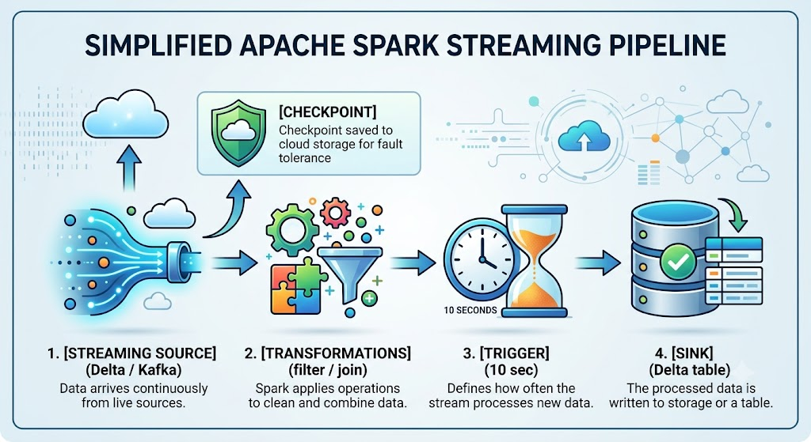
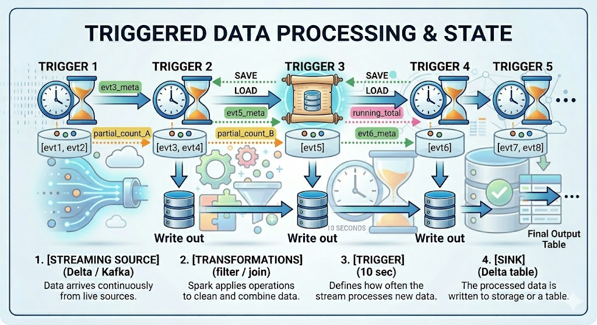
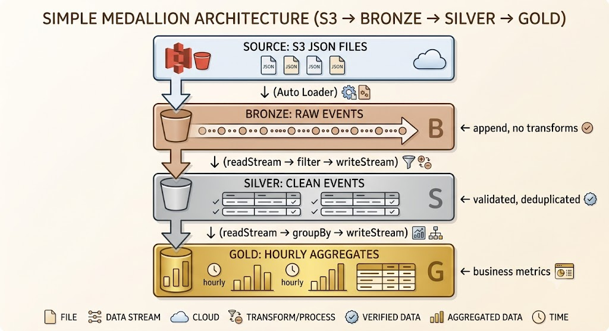

# Spark Structured Streaming, Incremental Ingestion and Medallon Architecture

## Streaming and Incremental Data Processing

This chapter covers how Databricks handles data that arrives continuously — from defining what a stream is, to building production-grade pipelines using the Medallion Architecture. These concepts represent a significant portion of the Databricks Certified Data Engineer Associate exam.

---

## What is a Data Stream?

A **data stream** is a continuous, unbounded sequence of data records that arrive over time — as opposed to a fixed dataset stored in a file or table. Instead of processing all data at once, streaming systems process records as they arrive (or in small groups called micro-batches).

### Key Idea

> In streaming, the dataset is never "complete." New data keeps arriving, and the system must handle it incrementally without reprocessing everything from the beginning.

Sources of streaming data include:
- IoT sensors sending readings every second
- Application logs being written in real time
- Kafka topics receiving events from web apps
- Database change feeds (CDC)

### Example

```
Time:  T1      T2      T3      T4      T5
Data:  [evt1] [evt2] [evt3] [evt4] [evt5] ...  → (infinite)
```

Each event is processed as it arrives (or in small batches), not after the stream ends — because it never ends.

---

## Batch Processing vs Incremental Processing

### Batch Processing

Batch processing runs a job over a **complete, fixed dataset** at scheduled intervals (e.g., nightly). All data is loaded, processed, and written at once.

- Simple to reason about
- High latency (results available only after the full job completes)
- Suitable for reports, end-of-day aggregations

### Incremental Processing

Incremental processing only handles **new or changed data** since the last run. It can be near-real-time (streaming) or scheduled (micro-batch).

- Lower latency
- More complex state management
- Suitable for real-time dashboards, alerts, continuous ETL

### Comparison Table

| Feature | Batch | Incremental |
|---|---|---|
| Data scope | Full dataset | New data only |
| Latency | High (minutes–hours) | Low (seconds–minutes) |
| Complexity | Low | Higher |
| Resource use | Periodic spikes | Steady, lower peaks |
| Typical trigger | Scheduled (cron) | Continuous or triggered |
| Reprocessing | Rerun entire job | Replay from checkpoint |
| Example tool | Spark batch job | Spark Structured Streaming |

### Certification Tip

> The exam may ask: *"What is the main advantage of incremental processing over batch?"*
> Answer: **Lower latency** — data is available sooner because only new records are processed.

---

## Spark Structured Streaming

### What is it?

**Spark Structured Streaming** is a scalable, fault-tolerant stream processing engine built on top of the Spark SQL engine. It lets you write streaming queries using the same DataFrame/SQL API you use for batch processing.

The key mental model: **treat a stream as an unbounded table** that grows continuously. New rows are appended to this table over time, and your query runs against it continuously.

### How it Works

1. **Source** — data is read from a streaming source (Kafka, Delta table, files, socket)
2. **DataFrame operations** — transformations applied (filter, join, aggregate, etc.)
3. **Trigger** — controls how often new data is processed (every N seconds, once, etc.)
4. **Sink** — results are written to an output destination (Delta table, Kafka, console)
5. **Checkpoint** — progress is saved so the stream can resume after failure

### Example



### Why it Matters

Structured Streaming is the backbone of streaming on Databricks. Most exam questions about streaming assume you're using this engine.

---

## Reading Streams with `readStream`

### Syntax

```python
df = (spark
  .readStream
  .format("delta")           # or "kafka", "cloudFiles", etc.
  .option("key", "value")    # source-specific options
  .load("/path/to/source")   # path or table name
)
```

### Explanation

- `spark.readStream` — tells Spark this is a streaming read (returns a streaming DataFrame)
- `.format("delta")` — specifies the data source type
- `.option(...)` — additional configuration (e.g., Kafka bootstrap servers, max files per trigger)
- `.load(...)` — the actual source location

A **streaming DataFrame** looks identical to a regular DataFrame, but it represents an unbounded, continuously updated table.

### Example: Read from a Delta table

```python
stream_df = (spark
  .readStream
  .format("delta")
  .load("/delta/bronze/events")
)

# Apply a transformation (just like batch)
filtered_df = stream_df.filter("event_type = 'click'")
```

### Example: Read new files from cloud storage (Auto Loader)

```python
stream_df = (spark
  .readStream
  .format("cloudFiles")         # Auto Loader format
  .option("cloudFiles.format", "json")
  .load("s3://bucket/raw/")
)
```

> **Auto Loader** (`cloudFiles`) is Databricks' optimized way to incrementally ingest files. It automatically detects new files and processes only those.

### Certification Tip

> `readStream` returns a **streaming DataFrame**. You cannot call `.show()` or `.count()` on it directly — those are batch operations. Use `writeStream` to output results.

---

## Writing Streams with `writeStream`

### Syntax

```python
query = (df
  .writeStream
  .format("delta")                   # output format
  .outputMode("append")              # how results are written
  .option("checkpointLocation", "/checkpoints/my_stream")
  .trigger(processingTime="10 seconds")
  .start("/delta/silver/events")     # output path or table
)
```

### Explanation

- `.writeStream` — starts the streaming write configuration
- `.format("delta")` — output sink type (delta, kafka, console, memory, etc.)
- `.outputMode(...)` — controls what rows are written each trigger (`append`, `complete`, `update`)
- `.option("checkpointLocation", ...)` — **required** for fault tolerance; saves stream progress
- `.trigger(...)` — how often to process new data
- `.start(...)` — launches the stream and returns a `StreamingQuery` object

### Example: Write to console (for testing)

```python
query = (filtered_df
  .writeStream
  .format("console")
  .outputMode("append")
  .option("checkpointLocation", "/tmp/checkpoint")
  .start()
)

query.awaitTermination()  # blocks until the stream is stopped
```

### Important: `start()` is non-blocking

`start()` launches the stream in the background. If running in a script (not a notebook), call `query.awaitTermination()` to keep the program alive.

---

## Delta Lake Streaming

### Stream from Delta Table

Delta tables are excellent streaming sources because they maintain a **transaction log** with every change. Structured Streaming can read from this log incrementally.

```python
bronze_stream = (spark
  .readStream
  .format("delta")
  .table("bronze.events")   # or .load("/delta/bronze/events")
)
```

When a new batch of rows is committed to the Delta table, the stream automatically picks them up on the next trigger.

### Stream to Delta Table

Writing a stream to a Delta table is the most common pattern on Databricks:

```python
query = (silver_df
  .writeStream
  .format("delta")
  .outputMode("append")
  .option("checkpointLocation", "/checkpoints/silver_events")
  .toTable("silver.events")    # writes to a managed Delta table
)
```

### Why Delta is Important for Streaming

| Feature | Why it Matters |
|---|---|
| Transaction log | Enables reliable incremental reads |
| ACID transactions | Safe concurrent writes |
| Schema enforcement | Catches bad data before it lands |
| Time travel | Replay historical data for reprocessing |
| Idempotent writes | Supports exactly-once semantics |

### Certification Tip

> Delta Lake is the **preferred sink and source** for Spark Structured Streaming on Databricks. Exam questions about streaming almost always involve Delta tables.

---

## Trigger Intervals and Micro-Batches

### Micro-Batch Processing

By default, Structured Streaming uses a **micro-batch** model: it collects new data over a short interval, processes it as a mini-batch, and writes the results. This repeats indefinitely.




### Trigger Options

```python
# Process every 10 seconds
.trigger(processingTime="10 seconds")

# Process all available data, then stop (one-shot run)
.trigger(availableNow=True)

# Process exactly one micro-batch, then stop (deprecated; use availableNow)
.trigger(once=True)

# Continuous processing (low-latency, limited support)
.trigger(continuous="1 second")
```

| Trigger | Behavior | Use Case |
|---|---|---|
| `processingTime` | Run every N seconds | Real-time continuous ingestion |
| `availableNow` | Process all backlog, then stop | Scheduled incremental batch |
| `once` | One micro-batch, then stop | Legacy; replaced by `availableNow` |
| `continuous` | Sub-millisecond latency | Specialized; limited operation support |

### Example: `availableNow` in a scheduled job

```python
query = (stream_df
  .writeStream
  .format("delta")
  .outputMode("append")
  .option("checkpointLocation", "/checkpoints/events")
  .trigger(availableNow=True)   # reads all pending data and stops
  .toTable("silver.events")
)
query.awaitTermination()
```

This is ideal when you want **incremental batch behavior** — process only new data, use a checkpoint, but run on a schedule rather than continuously.

### Certification Tip

> `availableNow=True` is the modern replacement for `once=True`. Both process available data and stop, but `availableNow` can use multiple micro-batches for large backlogs. **Know the difference for the exam.**

---

## Output Modes

Output mode controls **which rows are written to the sink** on each trigger.

### Append Mode

Only **newly computed rows** since the last trigger are written. Existing output is never changed.

```python
.outputMode("append")
```

- Default for most streaming queries
- Works with Delta, Kafka, files
- Does **not** support aggregations that update over time (e.g., running `COUNT`)
- Safe: no re-writing of past data

### Complete Mode

The **entire result table** is rewritten every trigger. All rows, including previously written ones, are output again.

```python
.outputMode("complete")
```

- Required for stateful aggregations (e.g., `GROUP BY` + `COUNT`)
- Only supported with aggregations
- Can be expensive — full rewrite each time
- Typically used with in-memory tables or small aggregated results

### Update Mode

Only **rows that changed** since the last trigger are written. Not supported by all sinks (not Delta files, for instance).

```python
.outputMode("update")
```

### Comparison

| Mode | Behavior | Typical Use Case |
|---|---|---|
| `append` | Only new rows written | Append-only event logging, ETL |
| `complete` | Full result rewritten | Running totals, leaderboards |
| `update` | Only changed rows | Kafka sink with key-based updates |

### Exam Tip

> The most common trap: using `complete` mode with Delta file sinks. **`complete` mode is not supported for file-based sinks** (including Delta) unless using `foreachBatch`. For aggregations to Delta, use `foreachBatch` or restructure the query.

---

## Checkpointing and Fault Recovery

### What is a Checkpoint?

A **checkpoint** is a persistent record of the streaming query's progress — specifically, which data has already been processed. It is stored in a cloud storage location (e.g., S3, ADLS, GCS).

A checkpoint contains:
- The **read offset** — how far into the source the stream has consumed
- **State information** — for stateful operations like windowed aggregations
- **Transaction metadata** — for exactly-once delivery

### Why it Matters

Without a checkpoint, if your stream fails or restarts, it would either:
- **Reprocess all data from the beginning** (duplicates)
- **Skip unprocessed data** (data loss)

With a checkpoint, the stream resumes exactly where it left off.

### How to Configure

```python
query = (df
  .writeStream
  .format("delta")
  .option("checkpointLocation", "s3://my-bucket/checkpoints/my_stream/")
  .outputMode("append")
  .start("/delta/silver/events")
)
```

> Each streaming query needs its **own unique checkpoint location**. Sharing checkpoints between different queries causes errors.

### Example Scenario

```
Stream running: processed offsets 0–500
→ Job fails at offset 501

On restart:
→ Stream reads checkpoint: "last processed = 500"
→ Resumes from offset 501
→ No duplicate processing, no data loss
```

### Certification Tip

> The `checkpointLocation` option is **required** for production streaming on Databricks. Forgetting it means the stream cannot recover from failure. The exam tests whether you know this is mandatory, not optional.

---

## Exactly-Once Semantics

### Definition

**Exactly-once semantics** means that every record is processed and written to the output **exactly one time** — no duplicates, no data loss — even if there are failures and retries.

There are three delivery guarantees:
- **At-most-once**: may lose data, never duplicates
- **At-least-once**: may duplicate, never loses data
- **Exactly-once**: no duplicates, no loss ✅

### How Delta Lake Helps

Delta Lake achieves exactly-once writes by combining:

1. **Idempotent writes** — writing the same data twice produces the same result (no duplicates)
2. **ACID transactions** — either the full micro-batch commits or nothing does
3. **Checkpoint + transaction log** — the stream knows exactly what was written and won't rewrite it

```
Micro-batch 5 fails mid-write
→ Delta transaction is rolled back (partial write discarded)
→ Stream restarts from checkpoint (offset before batch 5)
→ Micro-batch 5 is retried and committed cleanly
→ Result: no duplicates, no data loss
```

### Certification Tip

> Exactly-once in Spark Structured Streaming requires **both** a checkpoint location **and** an idempotent sink (like Delta Lake). Using a non-idempotent sink (e.g., appending to plain files without transaction support) only gives you **at-least-once** semantics.

---

## Fault Tolerance

### How Recovery Works

Structured Streaming achieves fault tolerance through two mechanisms:

1. **Checkpointing** — tracks read progress and state in durable storage
2. **Write-ahead logs (WAL)** — records operations before executing them

If a stream fails:
1. Spark reads the checkpoint to find the last committed offset
2. It re-reads unprocessed data from the source (source must be **replayable**, like Delta or Kafka)
3. It re-applies transformations
4. It writes results using idempotent Delta writes

### Requirements for Fault Tolerance

| Requirement | Why |
|---|---|
| Replayable source | Data must still be available after failure (Delta log, Kafka retention) |
| Checkpoint location | Saves progress between triggers |
| Idempotent sink | Prevents duplicates during retry |

### Example: Failure and Restart

```
T=10s  Trigger 1 runs → processes events 1–100 → checkpoint saved
T=20s  Trigger 2 runs → processes events 101–200 → checkpoint saved
T=25s  Cluster crashes mid-Trigger 3

On restart:
→ Checkpoint shows last committed = end of Trigger 2 (offset 200)
→ Trigger 3 re-reads events 201–300 from Delta source
→ Results written cleanly to sink
→ No data lost, no duplicates
```

---

## Streaming Limitations

### Unsupported Operations

Not all DataFrame operations work in streaming mode. The following are **not supported** (or have restrictions):

| Operation | Status | Reason |
|---|---|---|
| `show()` | ❌ Not supported | Requires materializing results |
| `count()` | ❌ Not supported | Requires complete scan |
| `sort()` / `orderBy()` | ❌ Not supported | Requires all data present |
| `distinct()` | ❌ Not supported | Requires full dataset |
| Multiple streaming aggregations | ❌ Not supported | Chained stateful ops not allowed |
| Joins between two streams | ⚠️ Limited | Requires watermarking |
| `limit()` | ❌ Not supported | Requires knowing total count |
| Non-time-based windows | ⚠️ Limited | Windowing needs time column |

### Why These Limitations Exist

Streaming operates on **unbounded data**. Operations like `sort`, `count`, and `distinct` require seeing **all** data before producing a result — which is impossible when the data never ends. These operations are fundamentally batch operations.

For aggregations, Structured Streaming supports them with **stateful processing** (e.g., windowed aggregations with `groupBy` + `window`), but they require output mode `complete` or careful watermarking.

### Exam Tip

> Common exam trap: writing a streaming query with `.sort()` or `count()` and asking why it fails. Answer: **these operations are not supported on unbounded streaming DataFrames**. Use windowed aggregations or `foreachBatch` (which gives you a batch DataFrame) to work around this.

```python
# ✅ Workaround using foreachBatch
def process_batch(batch_df, batch_id):
    batch_df.sort("timestamp").write.format("delta").mode("append").save("/delta/sorted")

    query = (stream_df.writeStream.foreachBatch(process_batch).option("checkpointLocation", "/checkpoints/sorted").start()
)
```

With `foreachBatch`, each micro-batch is passed as a **regular batch DataFrame**, so all batch operations are available.

---

## Medallion Architecture

The **Medallion Architecture** is a data design pattern that organizes data into three progressively refined layers: **Bronze → Silver → Gold**. It is a core Databricks best practice and appears frequently on the exam.

```
Raw Source Data
      ↓
  [BRONZE]  ← Raw, unprocessed data (as-is)
      ↓
  [SILVER]  ← Cleaned, validated, conformed data
      ↓
  [GOLD]    ← Aggregated, business-ready data
```

### Bronze Layer

**Purpose**: Ingest and preserve raw data exactly as it arrived from the source.

- No transformations applied
- Data stored as-is (JSON, CSV, or converted to Delta)
- Acts as an audit trail / source of truth
- Schema may be loose or inferred
- Allows replaying and reprocessing if downstream logic changes

**Examples**:
- Raw Kafka events written directly
- JSON files ingested via Auto Loader
- CDC records from a database

```python
# Writing raw events to Bronze
raw_stream = (spark
  .readStream
  .format("cloudFiles")
  .option("cloudFiles.format", "json")
  .load("s3://raw-events/")
)

raw_stream.writeStream \
  .format("delta") \
  .option("checkpointLocation", "/checkpoints/bronze") \
  .outputMode("append") \
  .toTable("bronze.events")
```

### Silver Layer

**Purpose**: Clean, validate, and conform Bronze data into reliable, queryable records.

- Apply data quality rules (drop nulls, fix types)
- Deduplicate records
- Join with reference/lookup data
- Standardize column names and formats
- Enforce schema

**Examples**:
- Filter out malformed records
- Parse timestamps into proper date types
- Join user events with user dimension table

```python
# Reading from Bronze, writing cleaned data to Silver
bronze_stream = spark.readStream.format("delta").table("bronze.events")

silver_df = (bronze_stream
  .filter("event_type IS NOT NULL")
  .withColumn("event_time", to_timestamp("event_timestamp"))
  .dropDuplicates(["event_id"])
)

silver_df.writeStream \
  .format("delta") \
  .option("checkpointLocation", "/checkpoints/silver") \
  .outputMode("append") \
  .toTable("silver.events")
```

### Gold Layer

**Purpose**: Aggregate and summarize Silver data for business analytics and reporting.

- Pre-aggregated metrics (daily counts, revenue totals)
- Denormalized tables optimized for BI tools
- Business-logic-heavy queries
- Often updated in batch (can also be streaming)

**Examples**:
- Daily active users
- Revenue by product and region
- Hourly clickthrough rates

```python
# Aggregate Silver into Gold (batch or streaming)
from pyspark.sql.functions import window, count

silver_stream = spark.readStream.format("delta").table("silver.events")

gold_df = (silver_stream
  .groupBy(window("event_time", "1 hour"), "event_type")
  .agg(count("*").alias("event_count"))
)

gold_df.writeStream \
  .format("delta") \
  .outputMode("complete") \
  .option("checkpointLocation", "/checkpoints/gold") \
  .toTable("gold.hourly_event_counts")
```

### Streaming Pipeline Example: Bronze → Silver → Gold



Each layer is a separate streaming job with its own checkpoint. This decouples each stage, making it easier to debug, replay, and maintain.

---

## Real-World End-to-End Example

### Scenario

A web application emits user click events as JSON files to S3. We want to:
1. Ingest raw events into **Bronze**
2. Clean and validate into **Silver**
3. Compute hourly event counts per user into **Gold**

### Step 1: Bronze — Ingest raw JSON files

```python
# Auto Loader reads new JSON files from S3 as they arrive
bronze_stream = (spark
  .readStream
  .format("cloudFiles")
  .option("cloudFiles.format", "json")
  .option("cloudFiles.schemaLocation", "/schema/bronze_events")
  .load("s3://app-logs/click-events/")
)

# Write raw data to Bronze Delta table
(bronze_stream
  .writeStream
  .format("delta")
  .outputMode("append")
  .option("checkpointLocation", "/checkpoints/bronze_events")
  .toTable("bronze.click_events")
)
```

- `cloudFiles` detects new files incrementally — no duplicate ingestion
- Schema is inferred and stored at `schemaLocation`

### Step 2: Silver — Clean and validate

```python
from pyspark.sql.functions import to_timestamp, col

# Read from Bronze
bronze_df = spark.readStream.format("delta").table("bronze.click_events")

# Apply cleaning rules
silver_df = (bronze_df
  .filter(col("user_id").isNotNull())              # remove records with no user
  .filter(col("page").isNotNull())                  # remove records with no page
  .withColumn("click_time", to_timestamp("ts"))     # parse timestamp string
  .drop("ts")                                        # remove raw timestamp column
  .dropDuplicates(["event_id"])                      # remove duplicates
)

# Write to Silver
(silver_df
  .writeStream
  .format("delta")
  .outputMode("append")
  .option("checkpointLocation", "/checkpoints/silver_events")
  .toTable("silver.click_events")
)
```

### Step 3: Gold — Aggregate hourly event counts

```python
from pyspark.sql.functions import window, count

# Read from Silver
silver_df = spark.readStream.format("delta").table("silver.click_events")

# Aggregate: count clicks per user per hour
gold_df = (silver_df
  .groupBy(
    window("click_time", "1 hour"),  # time-based window
    "user_id"
  )
  .agg(count("*").alias("click_count"))
)

# Write to Gold (complete mode for aggregation)
(gold_df
  .writeStream
  .format("delta")
  .outputMode("complete")
  .option("checkpointLocation", "/checkpoints/gold_events")
  .toTable("gold.hourly_user_clicks")
)
```

### SQL Equivalent (Gold Query)

```sql
-- Query the Gold table for the latest hourly counts
SELECT
  window.start AS hour_start,
  user_id,
  click_count
FROM gold.hourly_user_clicks
ORDER BY hour_start DESC, click_count DESC;
```

---

## Common Certification Questions

### Question 1

**Which output mode should you use when writing streaming aggregations to a Delta table?**

**A)** `append`
**B)** `complete`
**C)** `update`
**D)** Any mode works

**Answer: B — `complete`**

**Explanation**: Aggregations maintain state that can be updated as new data arrives. `complete` mode rewrites the full result table each trigger, which is required for grouped aggregations. `append` only works when new rows are never modified. Note: `complete` mode for Delta file sinks requires `foreachBatch` in some cases.

---

### Question 2

**A streaming job fails mid-execution. When it restarts, what prevents data from being reprocessed from the beginning?**

**A)** Auto Loader schema location
**B)** Delta table transaction log
**C)** Checkpoint location
**D)** Trigger interval setting

**Answer: C — Checkpoint location**

**Explanation**: The checkpoint saves the stream's read offset and state to durable storage. On restart, Spark reads the checkpoint to find exactly where processing left off, resuming without reprocessing old data.

---

### Question 3

**Which trigger option processes all available data and then automatically stops the stream?**

**A)** `processingTime="0 seconds"`
**B)** `once=True`
**C)** `availableNow=True`
**D)** `continuous="1 second"`

**Answer: C — `availableNow=True`**

**Explanation**: `availableNow` processes all pending data across multiple micro-batches and then stops. `once=True` is the older equivalent (single micro-batch only, now deprecated). `availableNow` is preferred for scheduled incremental batch jobs.

---

### Question 4

**Which of the following operations is NOT supported directly in a Spark Structured Streaming query?**

**A)** `filter()`
**B)** `withColumn()`
**C)** `sort()`
**D)** `groupBy()` with `window()`

**Answer: C — `sort()`**

**Explanation**: Sorting requires all data to be present before producing output — impossible on an unbounded stream. `filter`, `withColumn`, and windowed `groupBy` are all valid. To sort, use `foreachBatch` to operate on each micro-batch as a regular DataFrame.

---

### Question 5

**What does exactly-once semantics guarantee in Spark Structured Streaming with Delta Lake?**

**A)** Each record is processed within 1 second
**B)** Each record is written to the output exactly one time, with no duplicates or data loss
**C)** Each trigger processes exactly one record
**D)** The stream runs exactly once per day

**Answer: B**

**Explanation**: Exactly-once means that despite failures and retries, each input record produces exactly one output record. Delta Lake achieves this through idempotent writes and ACID transactions combined with checkpointing.

---

### Question 6

**In the Medallion Architecture, which layer stores raw, unmodified data as it was received from the source?**

**A)** Gold
**B)** Silver
**C)** Bronze
**D)** Platinum

**Answer: C — Bronze**

**Explanation**: Bronze is the landing zone for raw data. No transformations are applied, preserving the original data for audit and reprocessing. Silver cleans it; Gold aggregates it.

---

## Key Takeaways

- A **data stream** is an unbounded, continuously growing sequence of records — Structured Streaming treats it as an infinite table.
- **`readStream`** creates a streaming DataFrame; **`writeStream`** starts writing stream results to a sink.
- **Delta Lake** is the preferred streaming source and sink on Databricks due to ACID transactions, the transaction log, and idempotent writes.
- **Checkpoint location** is mandatory for fault-tolerant streaming — it saves progress so streams resume from where they left off without data loss or duplicates.
- **Output modes**: use `append` for new rows only; use `complete` for aggregations that rewrite all results each trigger.
- **Trigger options**: `processingTime` for continuous streaming; `availableNow` for scheduled incremental runs that stop after draining the backlog.
- **Exactly-once semantics** require a replayable source (Delta/Kafka), a checkpoint, and an idempotent sink (Delta) — all three together.
- **Unsupported operations** in streaming include `sort()`, `count()`, `distinct()`, and `limit()` — use `foreachBatch` to access batch APIs per micro-batch.
- The **Medallion Architecture** (Bronze → Silver → Gold) is the standard Databricks pattern: raw ingestion → cleaning → aggregation, each as a separate streaming stage with its own checkpoint.
- **Auto Loader** (`cloudFiles`) is the recommended way to incrementally ingest files from cloud storage into Bronze — it detects new files automatically and avoids reprocessing.