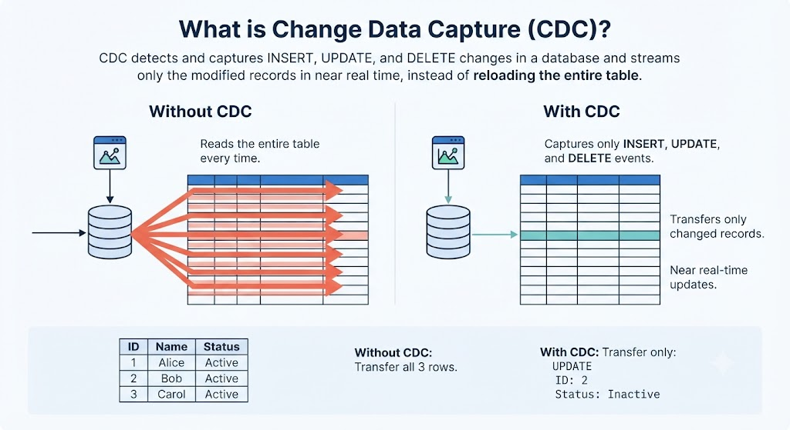
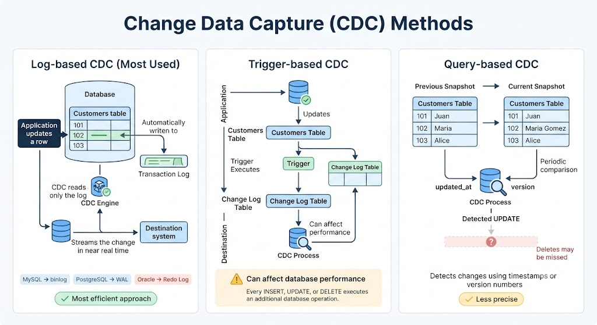
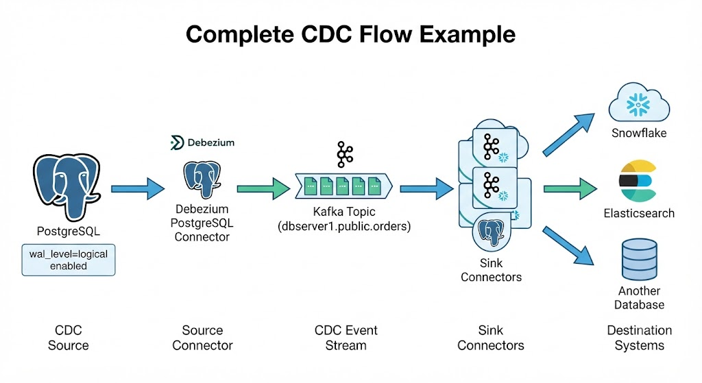

# Change Data Capture (CDC)

Change Data Capture: Capture and propagate changes **in near real-time**, without reloading all the data.

---

## What is CDC?

It's a technique that **detects and captures changes** occurring in a database (INSERTS, UPDATES, DELETES) to schedule them **almost in real time**, without reloading the entire database each time.

> Instead of copying **the entire database**, CDC captures **only the modified records**.



---

## What is it for?
It captures only what changed and enables these four use cases.

- ### Synchronize systems:
    Keep a replica, a **data warehouse**, or a **data lake** updated without constant batch loads.
    - replica
    - data warehouse
    - data lake

- ### Real-time integration: 
    Feed messaging systems so other apps **react instantly** to each change.
      - Kafka
      - RabbitMQ
      - apps

- ### Auditing: 
    Keep a complete history of **what changed, when**, and who did it.
    - What
    - When
    - Who

- ### Reduce load:
    Only new changes are processed, not the entire table every X minutes.
    - **~~SELECT *~~** → Only △ changes

---

## **Example: A Change Is Captured as an Event**

### **Source Table: Customers**

| ID  | Name                |
| --- | ------------------- |
| 101 | Juan                |
| 102 | Maria → Maria Gomez |

> **Without CDC, the entire table must be scanned again to detect this update.**

### **CDC Captures the Change**

**Captured Event (UPDATE)**

**Table:** Customers

```text
ID: 102

Before:
Name = "Maria"

After:
Name = "Maria Gomez"
```

> **With CDC, only this update is sent to the destination system, enabling near real-time data synchronization without rereading the entire table.**

---

## 3 Ways to Implement CDC (Implementation)

### Log-based (MOST USED)
Reads the **transaction log** from the database without affecting the source's performance.

- binlog → MySQL
- WAL → PostgreSQL
- redo → Oracle

> The most efficient today

### Triggers
**Triggers** are created in the tables that record changes to a helper table.

> Can affect performance

### Query-based
Compares the current state against the previous one using `updated_at` or `version` columns.

> Less precise, can miss deletes.



---

## The Complete Flow to Databricks (Architecture)

### Source
Active transaction log: `binlog`, `WAL`, `redo`.

### CDC Capture
Debezium, Fivetran, and AWS DMS read the log and publish events.

### Auto Loader
Ingests new files incrementally, without reprocessing everything.

### Bronze
Raw data + metadata: operation, timestamp, LSN.

### Silver
Reconciliation: `MERGE / APPLY CHANGES INTO`

### Gold
Aggregated tables for business and BI: dashboards and reports.

---

## How a Change Travels Through the Pipeline
1. Update: The change occurs
2. JSON event: Debezium publishes it
3. New file: Auto Loader ingests it
4. Raw row: Saved in Bronze
5. Current state: Reconciled in Silver

> Medallion Architecture: Bronze (raw) → Silver (reconciled) → Gold (business-ready).

---

## CDC Feed (Feed, Sources & Delivery)

The continuous flow of change events. If CDC is the **technique**, the feed is the product: the channel through which changes are sent, ready to be consumed.

## What each event contains
- Operation type: `INSERT / UPDATE / DELETE`
- Data **before** the change (`UPDATE / DELETE`)
- Data **after** the change (`INSERT / UPDATE`)
- Metadata: timestamp, table, LSN/offset

### event.json (Deberzium-style format)
```json
{
    "op": "u"
    "before": {"id": 1, "status": "Pending" },
    "after": {"id": 1, "status": "Sent"},
    "ts_ms": 1719878400000,
    "source": {"table": "Orders", "lsn": 123456}
}
```

Sometimes it also includes **READ** to represent initial loads.

---

## CDC Sources
The source system. If the feed is the output, the source is the input; the connector reads from it.

### Source connector
Debezium has connectors for each engine: MySQL, PostgreSQL, SQL Server, Oracle, MongoDB. Each one knows how to read the native mechanism of that database.

### Requirements on the source
- Transaction log enabled: binlog_format=ROW, wal_level=logical
- User with replication/log read permissions
- Sufficient log retention to avoid losing changes if the connector fails



---

## CDC Feed Delivery
How and with what guarantees are events delivered to the consumer: **continuous streaming** vs. **batch file**

### Data Stream
Events transmitted in **near real-time**, as soon as they occur at the source. Example: Debezium → Kafka, every change is published instantly.

- 👍 Near-instant synchronization, low latency
- Real-time dashboards, alerts, instant reaction

### JSON files
Changes are **accumulated** over a period (every 15 minutes, every hour) and exported to files. A separate process reads and applies them.

- 👍 Simple, less infrastructure, easy to audit/reprocess
- ⌛ Latency: the destination is not instantly synchronized

> ⭐ Typical example of JSON files: exporting changes from Salesforce or a database to an S3 bucket, and then an ETL job (Spark, Snowflake) processes them periodically.

---

## From `APPLY CHANGES INTO` to `AUTO CDC INTO` (CDC in Lakeflow SDP)

**old.sql (still works)**
```sql
APPLY CHANGES INTO LIVE.target_table
FROM STREAM(LIVE.cdc_feed_table)
KEYS (key_field)
APPLY AS DELETE WHEN op = "DELETE"
SEQUENCE BY sequence_field
COLUMNS *
```
**current.sql (recommended)**
```sql
CREATE OR REFRESH STREAMING TABLE target_table;
CREATE FLOW t_flow AS AUTO CDC INTO t
FROM STREAM(cdc_feed_table) KEYS (key_field)
APPLY AS DELETE WHEN op = "DELETE"
SEQUENCE BY seq.COLUMNS *
```

Same logic: only the command changes, and now you have to declare the destination **streaming table**.

### Destination Table
Where the changes are applied

### STREAM(...)
Reads the feed as a stream

### KEYS
Define update vs insert

### DELETE WHEN
Delete condition

### SEQUENCE BY
Orders if they arrive late

---

## Advantages of AUTO CDC (CDC in Lakeflow SDP)

- **Less code:** Reduces hundreds of lines of manual logic to just a few declarative lines.
- **Automatic sorting:** With `SEQUENCE BY`, it reorders records that arrive late or out of order.

- **Automatic upsert:** Updates if the key exists, inserts if not.
- **Flexible delete handling:** Optional, via `APPLY AS DELETE WHEN`.

- **Multiple keys + EXCEPT:** Multiple fields as primary keys; excludes columns with `EXCEPT`.

- **SCD support:** Type 1 (overwrite) and Type 2 (history). Bi-time tracking in beta.

> ⚠️ **Trade-off:** Because it updates and deletes data in the destination table, that table **can no longer be used as a streaming source** in later layers of the pipeline (breaks the append-only requirement).

---

## Name Migration

**Same Concepts, New Naming Conventions**

| Previous Name (Book / Legacy) | Current Name |
|--------------------------------|--------------|
| Delta Live Tables (DLT) | **Lakeflow Spark Declarative Pipelines(SDP)** |
| `APPLY CHANGES INTO` (SQL) | `AUTO CDC ... INTO` |
| `apply_changes()` (Python) | `create_auto_cdc_flow()` |
| `import dlt` | `from pyspark import pipelines as dp` |

---

# The Essentials of CDC
CDC is all about capturing **only what changes**, propagating those changes in near real time, and processing them through the **Bronze → Silver → Gold** architecture.

- **CDC captures only INSERT, UPDATE, and DELETE events** instead of rereading the entire source table.
- **Log-based CDC** is the most efficient and widely adopted implementation because it reads the database transaction log with minimal impact on the source system.
- A typical pipeline follows this flow: **Source Database → CDC Capture → Auto Loader → Bronze → Silver → Gold**.
- **CDC Source** is the database being monitored, the **CDC Feed** is the stream of change events it produces, and the **delivery mechanism** defines how those events are transported (Kafka, files, cloud messaging, etc.).
- **Bronze** stores the complete history of change events, **Silver** reconstructs the latest state of each record, and **Gold** builds business-ready aggregations on top of that current state.
- **`AUTO CDC INTO`** automates the manual `MERGE INTO` logic by handling sequencing, upserts, deletes, and deduplication declaratively within a Lakeflow Declarative Pipelines pipeline.