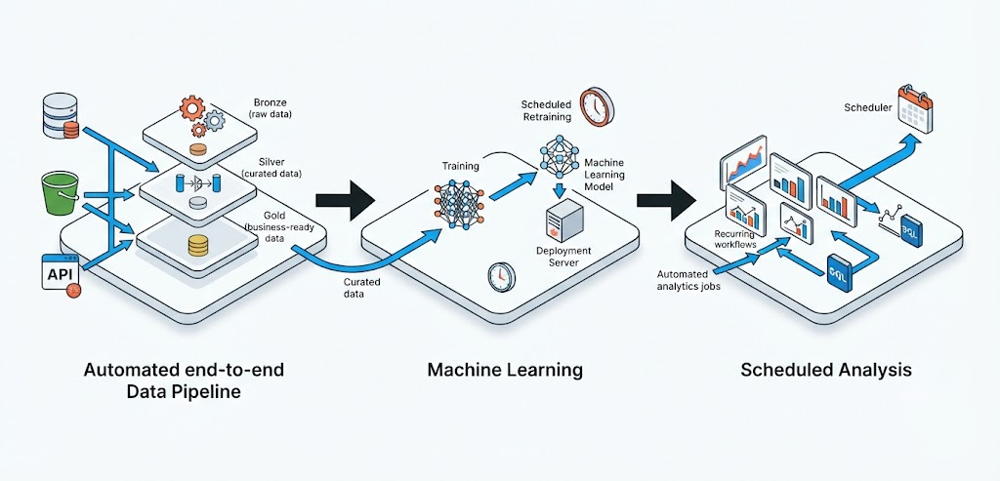

# Workflow Orchestration (LakeFlow Jobs)
Chain tasks in the correct order: automate data pipelines, train models, and schedule analysis with **Jobs**

---

## Databricks Jobs (What it is)
Databricks' **orchestration** tool

> ### Automates complete data flows by **chaining steps** that must be executed in a specific order.

It's renamed in the current UI:
~Workflows~ → Jobs & Pipelines
Today they are **Lakeflow Jobs**, in the **Jobs & Pipelines** section of the sidebar.

## They serve three main purposes:

### Data Pipeline
Automate end-to-end **ETL/ELT** processes.

### Machine Learning
Train and deploy models on a schedule.

### Scheduled Analysis
Run chained or timed data analysis.

---

## Fundamental Concepts (Vocabulary)

### Job (Container)
The main container. It groups tasks, their order, their trigger, and their configuration.

### Task (Unit)
A unit of work: a notebook, an SQL query, a pipeline, a script, etc.

### DAG (Directed Acyclic Graph)
The task and dependency diagram: boxes connected by arrows.

### Dependencies (depends on)
Which task(s) must complete successfully before another can begin. A task can depend on several others.

### Trigger
What triggers execution: manual, scheduled, file arrival, table change.

### Run (Execution)
A specific execution: date/time, status, and the result of each task.