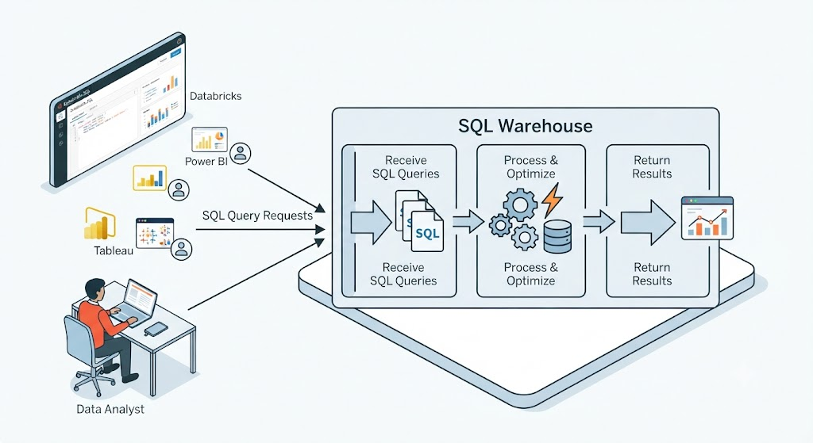
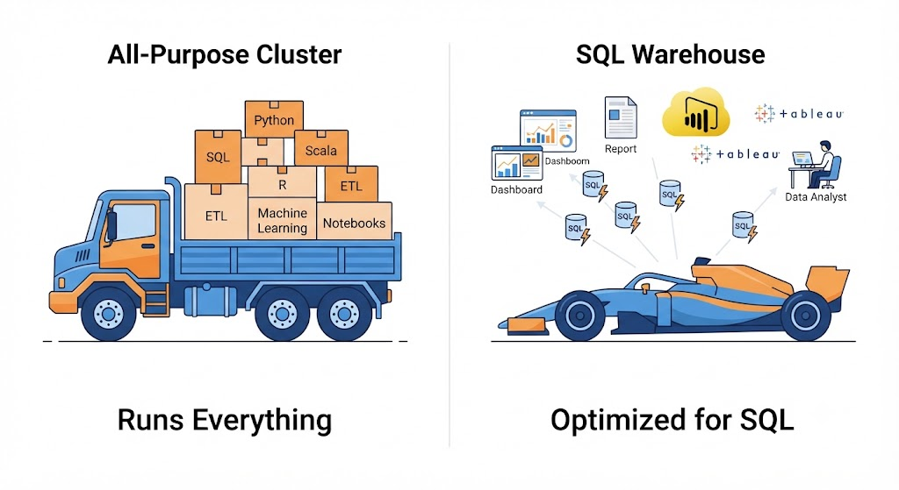
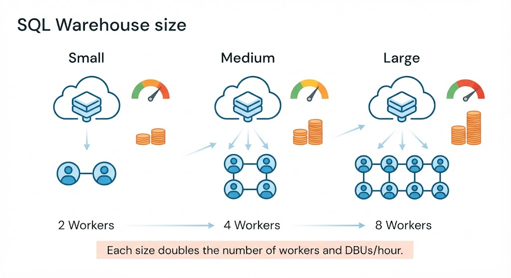

# Databricks SQL
Query, analyze, and visualize Lakehouse data with standard SQL. (No Python or Scala required)
- SQL Warehouse
- Dashboard
- DBU
- Unity Catalog
- Delta Lake

### **query_editor.sql**
```sql
-- Sales by country, last 30 days
SELECT country, SUM(sales) AS total_sales
FROM sales
GROUP BY country
ORDER BY total_sales DESC;
```

## User Distribution by Country

| Country | Users |
|---------|------:|
| Brazil (BR) | 128k |
| Mexico (MX) | 102k |
| Colombia (CO) | 71k |
| Argentina (AR) | 48k |

**Total rows:** 4

> From **SQL** to the **dashboard**, without leaving Databricks.

---

## What is Databricks SQL?

It's Databricks' service for **querying, analyzing, and visualizing** data using SQL **(without writing Python or Scala)**.

> Analysts and business users query data from **Delta Lake, Unity Catalog**, and other formats using **standard SQL**.

### Main Features
- **SQL queries at scale**: On large volumes of Lakehouse data.

- **Interactive dashboards**: Charts, tables, and filters for business use.
- **Scheduled queries**: Queries that run automatically.

- **Shared reports**: Results accessible to other users.

- **SQL warehouses**: Engines optimized for fast SQL execution.

---

## Two Worlds, One Lakehouse (Separation of Responsibilities)

### Notebooks, Jobs, DLT (Data Engineers & Data Scientists)
- Build data **pipelines**
- Create **Delta tables** and transform data
- Manage the Lakehouse (Engineering, Data Science, and AI)
> Python, SQL, Scala, R

### SQL Databricks (Data Analysts & Business Users)
- Query data with **SQL**
- Create **dashboards** and perform analysis
- Share **reports** with the business
> **SQL only**, analytics & BI

### The Lakehouse
The same **Delta Lake** tables, governed by **Unity Catalog** (one place for both worlds)

> Delta Lake, Unity Catalog

> ### **In summary:** Databricks SQL is a **BI and analytics** tool from Databricks (the environment where an analyst writes SQL queries, builds dashboards, and shares reports with the business).

## SQL Warehouse (The Engine)
It is a Databricks computing resource dedicated exclusively to executing SQL queries.

> Think of it as the equivalent of a **cluster specializing in SQL.**

### Its sole responsibility
1. Receive SQL queries
2. Process and optimize them
3. Return results as quickly as possible

> It is used by **Data Analysts** and **BI** tools (Power BI, Tableau, ...) every query you launch from Databricks SQL runs here.




---

## All-Purpose Cluster vs. SQL Warehouse

| Feature | All-Purpose Cluster | SQL Warehouse |
|---------|----------------------|---------------|
| **Primary Purpose** | General-purpose compute for development and data engineering | Dedicated compute optimized for SQL analytics |
| **Supported Languages** | Python, SQL, Scala, and R | SQL only |
| **Typical Workloads** | Notebooks, ETL pipelines, Machine Learning, ad hoc development | SQL queries, dashboards, reporting, and BI analytics |
| **Primary Users** | Data Engineers and Data Scientists | Data Analysts and BI tools (Power BI, Tableau, etc.) |
| **Flexibility** | Supports custom libraries and arbitrary code execution | Optimized exclusively for SQL execution |
| **Performance Focus** | Versatility and development | Fast, scalable, and efficient SQL query processing |

>
> Both compute resources access the **same Lakehouse data**, but they are optimized for different workloads.
>
> - 🚀 **All-Purpose Cluster** → Best for development, ETL, and Machine Learning.
> - ⚡ **SQL Warehouse** → Best for SQL analytics, dashboards, and BI workloads.
>
> **Choose the engine based on the workload—not by habit.**

---

## Why Not Always Use an All-Purpose Cluster? (Analogy)

### What an Analyst Really Needs

```SQL
SELECT country, SUM(sales)
FROM sales
GROUP BY country;
```

- Create dashboards
- Schedule reports
- Share queries
> No Python, pipelines, or libraries

### A Simple Way to Remember
General Purpose: Can run **everything**: Python, SQL, Scala, R, ETL, Machine Learning...

Specialized: Does **only one thing:** execute SQL, very fast and with **high concurrency**.

> For an analyst's work, a **SQL Warehouse consumes resources more efficiently** and is optimized to handle **many simultaneous queries**.



---

## Cluster size (creating a SQL Warehouse)

Defines **how many workers** (and how large) the cluster processing your queries has.

### Smaller size
- ⬇️ Lower latency: more compute resources per query
- ⬆️ Higher consumption: more DBUs burned per hour.

> Each size **doubles the number of workers** and doubles the DBUs/h.



---

## What is a DBU? (The consumption meter)

**DBU = Databricks Unit:** The abstract unit Databricks uses to measure computation. It's not a direct dollar amount (it works like "credits").

Each cluster size consumes a fixed number of DBUs per hour while the data warehouse is running.

Databricks charges for DBUs with per-second granularity while the warehouse is active.

The price per DBU varies depending on the warehouse type (Classic, Pro, Serverless) and your cloud and region.

### Your actual cost:
$$\text{cost} = \text{DBU consumed} * \text{price per DBU}$$
> size * uptime
> 
> depending on tier, cloud, region

### Cost example
**a Small warehouse in Classic (AWS)**
```text
size = Small → 12 DBU/h
uptime = 30 min
consumption = 12 * 0.5 = 6 DBU
price = $0.22 / DBU (Classic, AWS)
cost = 6 * $0.22 = $1.32 + your cloud VM
```

> Same DBU consumption, different final cost depending on the tier you choose