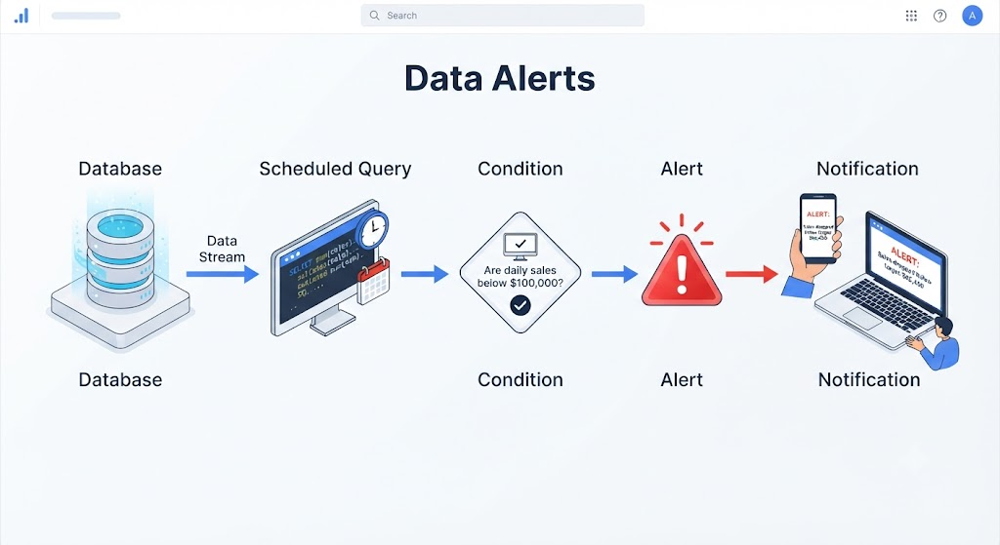

# SQL Editor

The Lakehouse's **SQL & AI** tools: query, prepare data without code, query in natural language, and monitor with alerts

- SQL Editor
- Visual Data Prep
- Genie Agents
- Alerts

```SQL
-- monthly_sales  (Last 30 days)
SELECT country, SUM(sales) AS total
FROM gold.fact_sales
WHERE order_date >= CURRENT_DATE - 30
GROUP BY country 
ORDER BY total DESC;
```

---

## What is the SQL Editor?

The Lakehouse environment designed for working with SQL on your data (without using Python or Scala).

- **Write:** SQL queries with autocomplete on the workspace.

- **Execute:** Directly against the Lakehouse tables.

- **Save:** Reusable and shareable queries with your team.

It's the primary tool for:

Data Analysts, Data Engineers, Business Users

```SQL
SELECT c.country, COUNT(c.id) AS orders
FROM silver.orders o
JOIN gold.dim_customer c
ON o.cust_id = c.id
GROUP BY c.country;
```

**The interface is similar to:**

BigQuery, Azure Data Studio, DBeaver

If you've used any of these, you'll feel right at home from the start.

---

## What can you do with it?

- **Query**: Tables, views, **joins**, aggregations... just the SQL you already know, directly on the Lakehouse.
  - SELECT
  - JOIN
  - GROUP BY
  - CREATE VIEW

- **Save queries**: Store queries for later reuse. **You don't have to rewrite them.**
  - Monthly_Sales
  - Active_Users
  - Revenue_Dashboard

- **Share**: Share with other users in the **workspace** so they can run or modify it.

- **Display**: Create charts directly from the query and add them to your **dashboards**.

---

## SQL Editor — Explore, Analyze, Share

Use it when you...

* Want to **quickly explore and analyze data**
* Only need to write **SQL queries**
* Want to create **dashboards and visualizations**
* Need to **share queries and results** with your team
* Don't need to write application code

> **Ideal for the day-to-day work of a Data Analyst.**

### Notebook — Program, Transform, Automate

Use it when you...

* Need to write code in **Python or Scala**
* Want to build **data transformation pipelines (ETL/ELT)**
* Have **Machine Learning** or advanced analytics needs
* Want to **automate data workflows and processes**
* Need to combine **SQL with Python or Scala**

> **The territory of Data Engineers and Data Scientists.**

---

## Visual Data Prep
A **no-code/low-code** tool for **cleaning, transforming, and preparing data** from a graphical interface (without writing SQL or Python)

### Instead of:
```python
df.dropDuplicates().fillana(0)...
```

### You do:
Click on the column → menu operation

> And if you want, **you can see the generated code** below

Same idea as:
- Power Query
- Alteryx
- Tableau Prep
- Trifacta → Google

---

### Ten Operations, Zero Code

* **Delete columns:** Remove columns that don't contribute to your analysis.
* **Rename:** Give columns clear and consistent names.
* **Change type:** Convert data types, such as `string → date` or `int → double`.
* **Filter records:** Keep only the rows that meet specific conditions.
* **Remove duplicates:** Ensure each record appears only once.
* **Replace nulls:** Fill missing values with appropriate defaults.
* **Calculated columns:** Create new fields based on existing data.
* **Join tables:** Combine data from multiple sources into a single dataset.
* **Group By:** Group and aggregate data in just two clicks.
* **Sort:** Sort data in ascending or descending order, on the fly.

---

## Why Use It and Who Uses It?

### Advantages

* **No advanced SQL knowledge required:** Perform common data transformations without writing complex queries.
* **Preview data as you transform it:** See the results of each transformation step before moving on.
* **Reduce errors:** Work visually instead of manually writing transformation logic.
* **Empower business users:** Prepare and transform data without relying as heavily on engineering teams.
* **Reproducible processes:** Transformations can be re-executed consistently whenever new data arrives.

### Who Typically Uses It?

* **Data Analysts:** Prepare and transform data before analysis.
* **Data Engineers:** Handle simple transformations and **rapidly prototype** data workflows.
* **Business Users:** Work with data independently, even with **limited programming experience**.

---

## Genie Agents: Ask Your Data
AI agents that understand **natural language** and query your Lakehouse.

Before: writing this...
```SQL
SELECT country,
       SUM(sales)
FROM sales
WHERE order_sales >= CURRENT_DATE - 30
GROUP BY country
ORDER BY SUM(sales) DESC;
```

Now simply ask:

"Which countries had the highest sales in the last 30 days?"
...

---

## What Can a Genie Agent Do?

Depending on how it's **configured**, a Genie Agent can:

* **Answer questions:** Ask questions about your data using natural language.
* **Generate SQL:** Automatically generate the SQL needed to answer your question.
* **Explain results:** Provide context and explain what the results mean.
* **Create charts:** Generate visualizations directly from the conversation.
* **Maintain context:** Understand and follow the context of previous messages in the conversation.
* **Use Unity Catalog:** Understand your **tables, columns, and metadata** through the catalog.
* **Invoke tools:** Use tools or functions defined and made available by your organization.

> **The idea:** Let **any user** interact with data conversationally—without needing to know SQL.

---

## How to Configure It?

Configuring a Genie Agent involves defining **what it can access, how it should understand the data, and how it should behave**.

### 1. Data Sources — What the Agent Can Query

Define the data the agent is allowed to use:

* **Unity Catalog tables**
* **Views**
* **Metrics**
* **Dashboards**

### 2. Business Context — What Things Mean

Provide the business knowledge the agent needs to interpret the data correctly:

* What each **table and column** represents.
* **KPI definitions** and business logic.
* **Synonyms and terminology**, such as:

  * `"clients"` = `"customers"`
  * `"sales"` = `"revenue"` *(if that's how your organization defines it)*

### 3. Instructions — The Rules of the Game

Define explicit rules for how the agent should answer questions:

* **What to answer**
* **What not to answer**
* How to interpret specific business concepts.
* How to resolve **ambiguities**.
* Which tables or metrics to use for specific questions.

**Examples:**

> When asked about **"sales"**, always use the `gold.fact_sales` table.

> For **"active users"**, use the `active_users_30d` metric and do not count duplicates.

### The Goal

Give the agent enough **data access, business context, and instructions** to produce answers that are not only technically correct, but also **aligned with your organization's definitions and business logic**.

---

## Data Alerts: Let Your Data Notify You

A mechanism that **monitors query results** and sends a **notification when a defined condition is met**.

### Ideal for:

* Monitoring **data quality**
* Detecting **pipeline failures**
* Verifying **SLA compliance**
* Monitoring **business KPIs**
* Identifying **data anomalies**

> The query runs automatically according to a defined schedule. If the result meets the configured condition, the alert triggers a notification.

### Example

> **Condition:** Daily sales < $100,000
> 
> **Action:** Send an alert to the data team
> 
> **Schedule:** Every morning at 8:00 AM



**The idea:** Instead of constantly checking your dashboards, **let the data tell you when something needs attention.**


---

## Alerts in Action: `failed_orders`

Suppose we want to monitor the number of failed orders and receive an alert whenever it exceeds **10**.

```sql
SELECT COUNT(*) AS failed_orders
FROM orders
WHERE status = 'FAILED';

-- Schedule: every hour
```

### How it works

The query runs automatically every hour and returns the current number of failed orders.

**Example 1 — No alert**

```text
failed_orders = 3

Condition: 3 > 10 ❌
Result: Nothing happens.
```

The system remains silent because the condition was not met.

**Example 2 — Alert triggered**

```text
failed_orders = 15

Condition: 15 > 10 ✅
Result: Alert triggered.
```

Depending on the configuration, the notification could be sent via **email, Slack, webhook, or another supported channel**.

> **If you're coming from Airflow:** Think of an alert as a **monitoring sensor**. It doesn't execute business logic—it observes the result of a query and notifies you when a defined condition is met.
>
> **Observability without building your own alerting system.**
