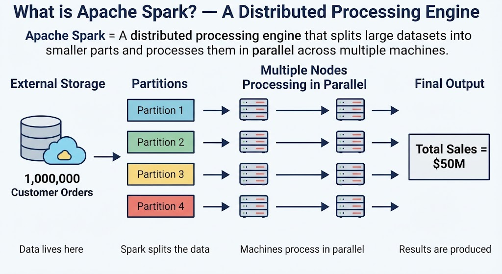
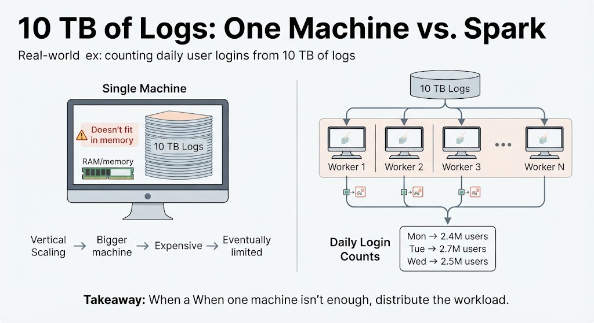

# Apache Spark

**Apache Spark** is a **distributed data processing engine** that splits large workloads into smaller pieces and processes them **in parallel across multiple machines**.

It is commonly used to process large datasets with tools such as **PySpark, Spark SQL, and Structured Streaming**.

### Key concepts

* **Partitioning**
  A large dataset is divided into smaller chunks called **partitions**. Each partition can be processed independently, allowing Spark to process data in parallel.

* **Tasks**
  A **task** is the unit of work Spark assigns to process **one partition**. For example, if a stage has 100 partitions, Spark creates 100 tasks for that stage.

* **Cores**
  A **CPU core** can execute a Spark task at a time. More available cores generally allow more tasks to run **in parallel**.

* **Executors**
  **Executors** are processes running on worker machines that execute Spark tasks and store data in memory or on disk when needed. Each executor has a certain number of CPU cores and a defined amount of memory.

* **Lazy Evaluation**
  Spark does not immediately execute transformations such as `filter()`, `select()`, or `join()`. Instead, it builds a **logical execution plan** and waits until an **action** such as `count()`, `collect()`, or `write()` requires a result. This allows Spark to optimize the entire computation before executing it.

---

## What is Apache Spark? A Distributed Processing Engine

**Apache Spark** is a **distributed processing engine** that processes massive amounts of data by splitting the workload across multiple machines and executing it in parallel.

A simplified flow looks like this:

1. **Data resides in external storage**
   The data is typically stored in systems such as Amazon S3, HDFS, or a data lake. Spark does not need to store the entire dataset in memory.

2. **Spark divides the data into partitions**
   Spark breaks the dataset into smaller chunks called **partitions**. Each partition can be processed independently.

3. **Nodes process the partitions in parallel**
   Spark distributes the partitions across multiple machines (nodes). Each node processes its assigned partitions concurrently.

4. **Results are combined into an output**
   After processing, Spark produces the requested result. Depending on the operation, the output may be distributed across multiple files or collected into a single result.

**In simple terms:**

> **Spark takes a large dataset, splits it into smaller pieces, processes those pieces in parallel across multiple machines, and produces the desired result.**



---

## What is Spark Used For?

Apache Spark is mainly used to **process and analyze large amounts of data efficiently by distributing the work across multiple machines**.

### 1. Large Volumes — Batch Processing

Spark is useful when datasets are **too large or too expensive to process on a single machine**.

It can process large amounts of data in batches, such as processing **several terabytes of sales data every night**.

> **Example:** Read 5 TB of transaction data → clean it → transform it → calculate daily sales → save the results.

### 2. Fast and Parallel — Distributed Processing

Spark divides the workload into smaller **partitions** and distributes them across multiple machines (**nodes**).

These machines can process their assigned data **at the same time**, making large workloads much faster than processing everything sequentially on one machine.

> **Example:** Instead of one machine processing 1 billion records, 100 machines can process different portions of those records simultaneously.

### 3. Machine Learning — Data Preparation

Spark can process and transform **large datasets before they are used to train machine learning models**.

It is particularly useful for tasks such as cleaning data, joining datasets, creating features, and aggregating information at scale.

> **Example:** Process billions of customer interactions → create customer features → produce a dataset ready for model training.

### 4. Large-Scale Queries — Spark SQL

**Spark SQL** allows you to use SQL to query very large datasets.

You can work with data stored across many files or machines **as if you were querying a regular table**, while Spark distributes the computation behind the scenes.

> **Example:** Query 10 TB of sales data to find total revenue by country using a SQL query.

### 5. Real-Time Data — Structured Streaming

**Structured Streaming** allows Spark to process **continuously arriving data** instead of waiting for a complete dataset.

Spark can consume events as they arrive, process them, and produce updated results continuously.

> **Example:** Receive millions of transactions → detect suspicious activity → update results as transactions arrive.

### Simple Mental Model

> **Spark is useful whenever you have a lot of data and need to process, transform, query, or analyze it efficiently at scale.**

**Batch:** Process data in large chunks
**Parallel:** Process many chunks at the same time
**SQL:** Query massive datasets
**ML:** Prepare data for machine learning
**Streaming:** Process continuously arriving data

---

## 10 TB of Logs and a Single Machine

### The Challenge

You have **10 TB of user logs** and want to calculate **how many users logged in each day**.

### With a Single Machine

**Pandas** is excellent for datasets that fit comfortably in the machine's memory.

But **10 TB is far larger than the memory of a typical machine**. You cannot simply load the entire dataset into a Pandas DataFrame and process it.

You could buy a machine with more memory, but this approach has a physical and economic limit.

> ⚠️ **Vertical scaling has limits:** making one machine bigger eventually becomes too expensive or impossible.

### With Apache Spark

Spark takes a different approach: **instead of making one machine bigger, use multiple machines.**

1. **Read the 10 TB of logs** from external storage.
2. **Split the data into partitions.**
3. **Distribute those partitions across multiple machines.**
4. **Process the partitions in parallel.**
5. **Combine the results** to calculate the number of users who logged in each day.

For example:



Each machine processes **only the partitions assigned to it**, rather than trying to hold the entire 10 TB dataset in memory.

> **The key idea:** Spark doesn't make 10 TB fit into one machine. **It distributes the work across many machines.**

### The Core Difference

| Single Machine                           | Apache Spark                                 |
| ---------------------------------------- | -------------------------------------------- |
| One machine processes the data           | Multiple machines process the data           |
| Limited by one machine's resources       | Resources can be distributed across machines |
| Scale by making the machine bigger       | Scale by adding more machines                |
| Eventually reaches a physical/cost limit | Can scale horizontally                       |

> **Pandas:** “How can I make one machine handle this dataset?”
> **Spark:** “How can I distribute this dataset across many machines?”

---

## Why Is Apache Spark So Well-Known?

### Distributed Internally, Simple Externally

One of Spark's biggest strengths is that **the code you write can look simple, even though Spark may execute the work across many machines behind the scenes**.

For example:

```python
# Read the data
data = spark.read.csv("usuarios.csv", header=True)

# Count users by date
resultado = data.groupBy("fecha").count()

resultado.show()
```

At first glance, this looks similar to working with a regular DataFrame.

But when Spark executes:

```python
data.groupBy("fecha").count()
```

it can **distribute the computation across multiple machines** when running in a cluster.

You don't have to manually tell each machine:

> “You process these rows, you process those rows, and then combine the results.”

**Spark handles that complexity for you.**

### The Important Idea

```text
You write simple code
       ↓
Spark creates an execution plan
       ↓
Spark distributes the work
       ↓
Multiple machines process the data
       ↓
Spark combines the results
       ↓
You get the final DataFrame
```

This separation is a major reason Spark became so popular:

> **Simple interface for the developer, distributed execution underneath.**

### You Don't Need to Learn a New Programming Language

Spark can be used through several familiar languages:

* **Python** → PySpark
* **Scala**
* **Java**
* **R**

For example, a Python developer can use Spark without having to write low-level distributed systems code.

### Why Is Spark Everywhere?

Because the same core engine can support many different data workloads:

* **Big Data** → process massive datasets
* **Data Engineering** → build ETL/ELT pipelines
* **Machine Learning** → prepare and transform data at scale
* **Data Analytics** → query and analyze large datasets

> **The key idea:** Spark hides much of the complexity of distributed computing behind a familiar DataFrame and SQL interface.

---

## Spark Is Not a Database

**Apache Spark is a processing engine, not a database.**

Spark does **not permanently store your data or tables**. Instead, it reads data from external storage, processes it, and writes the results back to storage.

### How It Works

```text
External Storage
      ↓
   Spark reads
      ↓
 Distributed processing
      ↓
   Spark writes
      ↓
External Storage
```

For example:

```text
S3 / HDFS / Database
        ↓
      Spark
        ↓
Transform / Filter / Join / Aggregate
        ↓
S3 / Data Lake / Database
```

The important distinction is:

* **Database / Data Lake** → stores the data
* **Spark** → processes the data

Spark can **temporarily keep data in memory or on disk during processing**, such as cached or shuffled data, but this is not the same as being the permanent storage system for your tables.

### Classic Exam Question

> **“Where does Spark store your tables?”**

**Answer:** Spark itself doesn't provide permanent table storage. The underlying data is stored in an external system, such as **S3, HDFS, or a database**.

> **Think of Spark as the worker, not the warehouse:** the warehouse stores the data; Spark takes the data, processes it, and puts the result back.

---

## The Data Isn't Moved: It's Organized

When you write:

```python
data = spark.read.parquet("s3://data/sales/")
```

Spark **does not immediately download the 1 TB of data into memory**.

Instead, Spark creates a **DataFrame that represents the data stored in S3** and builds a plan for how it will access and process that data.

### What Actually Happens?

```text
        S3
   1 TB of data
        │
        │  "I want to work with this data"
        ▼
      Spark
        │
        ├── Understands the data
        ├── Creates a logical plan
        └── Organizes the work into partitions
```

The important point is that **the data remains in S3**.

Spark keeps a **representation of the dataset**, rather than immediately loading all the data into memory.

When you eventually perform an action, such as:

```python
data.count()
```

Spark determines what data needs to be read, reads the relevant portions from S3, and processes them across the cluster.

### Think of It Like This

Imagine you have **1 TB of books stored in a warehouse**.

Calling:

```python
spark.read.parquet(...)
```

is **not** like taking all the books out of the warehouse and putting them in your office.

It's more like telling Spark:

> **“I want to work with the books in this warehouse.”**

Spark keeps track of **where the data is and how it can be processed efficiently**. When the work actually needs to happen, it retrieves and processes the necessary data.

> **Key idea:** `spark.read` is mainly about creating a **representation of the external data**, not loading the entire dataset into memory.

---

## What Is a Partition?

A **partition** is a **logical chunk of a dataset that Spark uses as a unit of processing**.

Think of it as dividing a huge dataset into smaller **work packages** so Spark can process them independently.

### 1. Logical, Not Physical

A partition is **not necessarily a new file or a copy of the data**.

It simply represents:

> **“This portion of the dataset will be processed together.”**

For example, a 1 TB dataset might be divided into 100 partitions of roughly 10 GB each.

The original data can still remain in external storage such as S3 or HDFS.

### 2. A Unit of Work

A partition is the **basic unit of data that Spark processes**.

For example:

```text
1 TB Dataset
     ↓
┌──────┬──────┬──────┬──────┐
│ P1   │ P2   │ P3   │ P4   │ ...
└──────┴──────┴──────┴──────┘
```

Spark can assign these partitions to tasks that process them.

### 3. Enables Parallelism

Because partitions can generally be processed independently, Spark can process **multiple partitions at the same time**.

```text
Partition 1 → Worker 1
Partition 2 → Worker 2
Partition 3 → Worker 3
Partition 4 → Worker 4
```

This is what allows Spark to **scale data processing across multiple CPU cores and machines**.

### Key Idea

> **A partition is a logical chunk of data that Spark uses as a unit of parallel processing.**

**Dataset → Partitions → Tasks → Parallel Processing**

---

## 1,000 Partitions, 10 at a Time

Imagine Spark has **1,000 partitions** but only enough available resources to process **10 tasks at once**.

It does **not** need to process all 1,000 partitions simultaneously.

Instead:

```text
1,000 partitions
      ↓
┌─────────────────────┐
│  10 partitions      │ → Process
└─────────────────────┘
      ↓
┌─────────────────────┐
│  Next 10 partitions │ → Process
└─────────────────────┘
      ↓
        ...
      ↓
┌─────────────────────┐
│  Final 10 partitions│ → Process
└─────────────────────┘
      ↓
   Completed
```

The key idea is that **Spark processes as many tasks in parallel as its available resources allow**. When those tasks finish, Spark can schedule the next batch.

So having **1,000 partitions does not mean you need enough memory or CPU to process all 1,000 at once**.

> **Spark doesn't need to handle everything at once. It needs enough resources to process multiple pieces in parallel.**

This is one of the fundamental ideas behind distributed processing: **a large dataset can be broken into many small units of work and processed progressively across the available resources.**

---

## The 5 Actors of Spark Execution

These five concepts explain **who organizes the work, what gets processed, what work is performed, and where/how it runs**.

### 1. Driver — Who Organizes?

The **Driver** is the **brain of the Spark application**.

It creates the execution plan, coordinates the work, sends tasks to executors, and monitors their progress.

> **Driver = “I organize and coordinate the work.”**

### 2. Partition — What Data?

A **partition** is a **logical portion of the dataset** that Spark processes independently.

> **Partition = “This is the piece of data we need to process.”**

### 3. Task — What Work?

A **task** is the **actual unit of work Spark performs on one partition**.

For example, if Spark needs to filter a partition, the task performs that filtering.

> **Task = “Process this partition.”**

A useful rule:

**One task processes one partition for a given stage.**

### 4. Core — With What Resource?

A **CPU core** is the computational resource that **executes a task**.

If an executor has 4 available cores, it can generally run up to **4 tasks concurrently**.

> **Core = “This CPU resource executes the task.”**

### 5. Executor — Where Does It Execute?

An **Executor** is a **process running on a worker machine** that provides CPU cores and memory for executing Spark tasks.

It receives tasks from the Driver and executes them using its available cores.

> **Executor = “This process provides the resources and environment where tasks run.”**

### How They Connect

```text
Driver
  │
  │ schedules
  ▼
Tasks
  │
  │ each processes
  ▼
Partitions
  │
  │ executed using
  ▼
CPU Cores
  │
  │ provided by
  ▼
Executors
  │
  ▼
Worker Machines
```

### The Mental Model

> **Driver** → organizes the work
> **Partition** → the data to process
> **Task** → the work to perform
> **Core** → the CPU resource that performs it
> **Executor** → the process that provides those resources and runs the task

**Important:** A partition is **not** a machine, and a task is **not** a machine. A task runs on an executor, using one of the executor's available CPU cores.

---

## The Complete Execution Chain

The easiest way to understand Spark execution is to follow the work **from the coordinator down to the data**:

```text
DRIVER
  ↓
EXECUTORS
  ↓
CORES
  ↓
TASKS
  ↓
PARTITIONS
```

### 1. Driver — The Coordinator

The **Driver** coordinates the entire Spark application.

It creates the execution plan, determines the work that needs to be done, and schedules tasks across the available executors.

> **Driver = “I organize the work.”**

### 2. Executors — The Workers

**Executors** are processes running on worker machines.

They provide the **CPU cores and memory** needed to execute Spark tasks.

> **Executor = “I provide the environment where the work runs.”**

### 3. Cores — The Muscle

A **CPU core** executes a Spark task.

An executor can have multiple cores, allowing it to execute multiple tasks **at the same time**.

> **Core = “I execute the task.”**

### 4. Tasks — The Work

A **task** is a unit of work that processes **one partition for a given stage**.

The Driver creates and schedules these tasks based on the execution plan.

> **Task = “Process this partition.”**

### 5. Partitions — The Data

A **partition** is a logical portion of the dataset.

Spark breaks the dataset into partitions so that different tasks can process different portions independently.

> **Partition = “This is the piece of data to process.”**

### Putting It All Together

Suppose Spark has **4 partitions** and an executor with **4 cores**:

```text
                 DRIVER
            "Organize the work"
                   │
          ┌────────┴────────┐
          ▼                 ▼
     EXECUTOR 1        EXECUTOR 2
      2 cores           2 cores
       │  │              │  │
       ▼  ▼              ▼  ▼
      T1  T2            T3  T4
       │  │              │  │
       ▼  ▼              ▼  ▼
      P1  P2            P3  P4
```

The four tasks can run **in parallel**, with each task processing one partition.

> **Driver → schedules tasks → executors run them → cores execute them → each task processes a partition.**

The most important relationship to remember is:

**1 Partition → 1 Task → 1 Core at a time**.

---

## Lazy Evaluation

**Lazy evaluation** means that Spark **does not execute transformations immediately**. Instead, it builds a plan of what needs to be done and waits until an **action** requires a result.

Using your example:

```python
data = spark.read.parquet("s3://sales/")

data2 = data.filter(data.country == "CO")

data3 = data2.select("customer", "total")

data3.show()
```

### What happens?

When you run:

```python
data = spark.read.parquet("s3://sales/")
```

Spark creates a **representation of the data** and knows where it is stored. It does not immediately process the entire dataset.

Then:

```python
data2 = data.filter(data.country == "CO")
```

Spark records:

> “When you eventually need the result, filter the data to Colombia.”

Then:

```python
data3 = data2.select("customer", "total")
```

Spark records another instruction:

> “After filtering, keep only these two columns.”

**Still, Spark hasn't actually processed the data.**

The execution starts when you call:

```python
data3.show()
```

`show()` is an **action**, so Spark now needs to produce a result.

```text
read parquet
     ↓
filter country = "CO"
     ↓
select customer, total
     ↓
    show()
     ↓
EXECUTE
```

### Why Does Spark Work This Way?

Because Spark can see the **whole chain of operations before executing it**.

This allows Spark to optimize the execution plan—for example, it can avoid reading unnecessary columns or processing unnecessary data whenever possible.

> **Transformations:** Describe what you want to do → **not executed immediately**
> **Actions:** Ask Spark for a result → **execution starts**

### Simple Mental Model

Think of it like **writing instructions for a delivery driver**:

> “Go to the warehouse → pick only Colombian orders → keep customer and total → show me the result.”

Spark doesn't start driving after every instruction. It **collects the instructions, plans the trip, optimizes it, and then executes the plan when you actually need the result**.

**Lazy evaluation = Spark plans first, executes later.**

---

## Transformations vs. Actions

Spark operations are generally divided into two categories: **transformations** and **actions**.

| Transformations                               | Actions                                               |
| --------------------------------------------- | ----------------------------------------------------- |
| Define how the data should be changed         | Trigger the execution of the plan                     |
| Are **lazy**                                  | Actually **execute** the computation                  |
| Return a new DataFrame or Dataset             | Return a result or produce an output                  |
| Examples: `filter()`, `select()`, `groupBy()` | Examples: `count()`, `show()`, `collect()`, `write()` |

### Transformations

A **transformation** describes a change you want to make to the data.

```python
filtered = data.filter(data.country == "CO")
selected = filtered.select("customer", "total")
```

Spark does **not** execute these operations immediately. It adds them to the execution plan.

> **Transformation = “Tell Spark what you want to do.”**

### Actions

An **action** tells Spark:

> **“I need the result now.”**

For example:

```python
selected.show()
```

or:

```python
selected.count()
```

At this point, Spark executes the necessary transformations to produce the result.

> **Action = “Execute the plan and give me a result.”**

### Important Correction to the Shortcut

A useful rule of thumb is:

> **If an operation returns a DataFrame, it is usually a transformation. If it triggers execution and produces a result or external output, it is an action.**

However, **`groupBy()` is a transformation, even though it does not immediately return a DataFrame-like result by itself**. It creates a grouping operation that is completed when you apply something like `.count()`.

### Mental Model

```text
Transformations
filter()
   ↓
select()
   ↓
groupBy()
   ↓
     ────────────────
          PLAN
     ────────────────
             ↓
          ACTION
         count()
             ↓
         EXECUTE
             ↓
          RESULT
```

**Transformations build the plan. Actions trigger the execution.**

---

## Knowing the Complete Plan = Optimizing

One of Spark's biggest advantages is that **lazy evaluation lets Spark see the entire chain of transformations before executing them**.

For example:

```python
data = spark.read.parquet("s3://sales/")

result = (
    data
    .filter(data.country == "CO")
    .select("customer", "total", "date")
)

result.show()
```

The final result only needs **3 columns**:

* `customer`
* `total`
* `date`

Spark can analyze the complete plan and determine that it **doesn't need to read every column from the Parquet files**.

Instead:

```text
Parquet file
100 columns
     ↓
Spark analyzes the plan
     ↓
Read only 3 columns
     ↓
Filter the relevant rows
     ↓
Process less data
     ↓
Faster execution
```

This is an example of **projection pushdown**: Spark pushes the column selection as close to the data source as possible.

### Why Does the Complete Plan Matter?

If every operation were executed immediately, Spark wouldn't know what you were going to do next.

With lazy evaluation, Spark can ask:

> **“What is the final result the user actually needs?”**

Then it can optimize the work required to produce it.

> **Read less → process less → move less data → finish faster.**

This is one of the key reasons **lazy evaluation is so important in Spark**: Spark doesn't just execute your code—it can **optimize the execution plan before doing the work**.
